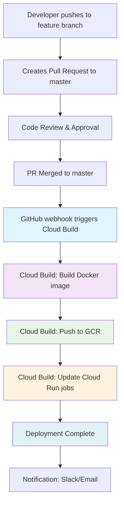

# CI/CD Pipeline Plan for StablecoinPoolOpt

## Overview

This document outlines the plan for implementing a CI/CD pipeline that automates deployments when a pull request is merged to the master branch, replacing the current manual deployment process using `gcloud builds submit`.

## Current State

- Manual deployment using `gcloud builds submit --config cloudbuild.yaml .`
- Build uploads ~650MB of data, which is slow
- Existing [`cloudbuild.yaml`](../cloudbuild.yaml) builds and pushes Docker image
- Infrastructure managed via Terraform with Cloud Run jobs and workflows
- Commented-out Cloud Build trigger in [`terraform/main.tf`](../terraform/main.tf:115-131)

## Proposed CI/CD Pipeline Architecture

### Pipeline Flow

### Key Components

#### 1. Cloud Build Trigger Configuration
- Trigger on push to master branch (after PR merge)
- Use the existing [`cloudbuild.yaml`](../cloudbuild.yaml) with optimizations
- Add build caching to reduce the 650MB upload issue

#### 2. Optimized Docker Build Process
- Implement multi-stage builds to reduce image size
- Use Cloud Build's built-in cache (gcr.io/cloud-builders/docker)
- Optimize [`Dockerfile`](../Dockerfile) layering for better caching

#### 3. Terraform Integration
- Uncomment and configure the Cloud Build trigger in [`terraform/main.tf`](../terraform/main.tf:115-131)
- Add necessary IAM permissions for Cloud Build service account
- Ensure proper GitHub connection setup

#### 4. Service Account & Permissions
- Cloud Build service account needs:
  - `roles/cloudbuild.builds.builder`
  - `roles/run.admin` (to update Cloud Run jobs)
  - `roles/iam.serviceAccountUser` (to impersonate other service accounts)

#### 5. Build Optimizations
- Use `.dockerignore` to exclude unnecessary files
- Implement layer caching strategies
- Consider using Google Cloud Artifact Registry instead of GCR

## Implementation Steps

1. **Create .dockerignore file** to reduce build context
2. **Optimize Dockerfile** for better layer caching
3. **Update cloudbuild.yaml** with caching configuration
4. **Configure Terraform** Cloud Build trigger resource
5. **Set up GitHub connection** in Google Cloud Console
6. **Configure IAM permissions** for Cloud Build service account
7. **Test the pipeline** with a sample PR merge

## Benefits

- **Automated deployments**: No more manual `gcloud builds submit` commands
- **Faster builds**: Through caching and optimized Docker layers
- **Reduced upload size**: With proper .dockerignore
- **Git-based workflow**: Deployments tied to PR merges
- **Audit trail**: All deployments tracked in Cloud Build history
- **Scalability**: Easy to add more environments (staging, prod)

## Security Considerations

- Use GitHub's branch protection rules for master
- Implement required PR approvals
- Use secrets management for sensitive data
- Regularly rotate service account keys

## Files to be Created/Modified

### New Files
- `.dockerignore` - Exclude unnecessary files from Docker build context
- `context/cicd-pipeline-plan.md` - This documentation file

### Modified Files
- `Dockerfile` - Optimize for better layer caching
- `cloudbuild.yaml` - Add caching configuration
- `terraform/main.tf` - Uncomment and configure Cloud Build trigger

## Next Steps

After documentation is approved, switch to Code mode to implement:
1. Create `.dockerignore`
2. Optimize `Dockerfile`
3. Update `cloudbuild.yaml`
4. Configure Terraform Cloud Build trigger
5. Set up GitHub connection
6. Configure IAM permissions
7. Test the pipeline

## Testing Strategy

1. Create a test branch
2. Make a small change
3. Create a PR to master
4. Get PR approved and merged
5. Verify Cloud Build triggers automatically
6. Verify Docker image builds and pushes successfully
7. Verify Cloud Run jobs are updated with new image
8. Verify deployment completes successfully

## Rollback Plan

If deployment fails:
1. Cloud Build will automatically stop on failure
2. Previous Cloud Run jobs continue running with old image
3. Investigate failure in Cloud Build logs
4. Fix issues and merge new PR
5. New deployment will replace failed one

## Monitoring & Alerts

- Cloud Build build status notifications
- Cloud Run deployment success/failure alerts
- Slack notifications for deployment status (optional)