# Cloud Run Performance Optimization Investigation

## Overview
This document details the investigation into significant performance discrepancies between local pipeline runs (fast) and GCP Production pipeline runs (slow). The investigation identified six key bottlenecks primarily related to Cloud Run architecture and configuration.

## Performance Analysis Summary

```mermaid
flowchart TB
    subgraph "Local Execution"
        L1[main_pipeline.py] --> L2[subprocess.run per script]
        L2 --> L3[Shared Python environment]
        L3 --> L4[Local DB connection]
        L4 --> L5[Single process flow]
    end
    
    subgraph "Production Execution (GCP)"
        P1[Cloud Scheduler] --> P2[GCP Workflows]
        P2 --> P3[21 Cloud Run Jobs<br/>Sequential Execution]
        P3 --> P4[Container Cold Start<br/>8-15s per job]
        P4 --> P5[VPC Network Setup]
        P5 --> P6[DB Connection via<br/>Private IP]
        P6 --> P7[Container Teardown]
    end
    
    style P4 fill:#ff6b6b,stroke:#333
    style P5 fill:#ff6b6b,stroke:#333
```

## Key Performance Bottlenecks Identified

### 1. Container Cold Start Overhead (MAJOR)
Each of the **21 Cloud Run Jobs** incurs a cold start penalty of **8-15 seconds**. With strictly sequential execution in `workflow.yaml`, this creates substantial overhead that doesn't exist locally where the Python environment is reused.

- **Minimum overhead**: 21 jobs × 8s = **168 seconds (2.8 minutes)**
- **Maximum overhead**: 21 jobs × 15s = **315 seconds (5.25 minutes)**

### 2. Sequential Workflow Execution
The current `workflow.yaml` executes all 21 steps strictly sequentially, even though Phase 1 data ingestion steps (e.g., fetching OHLCV, Gas data, Pool info) are independent and could run in parallel.

### 3. Heavy ML Image Sizes
The `defi-pipeline-ml-science` image used for forecasting and optimization jobs is heavy (~1.8GB) due to libraries like pandas, numpy, scikit-learn, xgboost, lightgbm, cvxpy, and ortools. Larger images lead to longer pull times and increased cold start latency.

### 4. Database Connection Setup Per Job
Each job establishes a new database connection with:
- 30-second connection timeout
- Up to 3 retries with 2-second delays
- No shared connection pooling across jobs (each job is a fresh process)

### 5. VPC Network Egress Setup
Each Cloud Run job must establish VPC connectivity (`vpc_access` with `PRIVATE_RANGES_ONLY`) to communicate with Cloud SQL, adding setup time to every job execution.

### 6. Small Database Instance
The production database is running on the `db-g1-small` tier, which provides limited CPU/memory resources, potentially acting as a bottleneck for query execution and handling concurrent connections during pipeline runs.

## Recommendations

### High Impact (Immediate Quick Wins)

#### 1. Implement Parallel Execution for Independent Steps
Modify `workflow.yaml` to run independent Phase 1 data ingestion steps in parallel using GCP Workflows' `parallel` branches.
- **Expected Impact**: 40-60% reduction in Phase 1 execution time.

#### 2. Upgrade Database Instance Tier
Upgrade from `db-g1-small` to at least `db-custom-2-4096` (2 vCPU, 4GB RAM) to improve query performance and connection handling.
- **Expected Impact**: Faster query execution and better stability.

#### 3. Implement Lazy Import Pattern
Refactor Python scripts, especially ML-heavy ones, to import large libraries (lightgbm, xgboost, cvxpy) only inside the functions where they are needed, rather than at the top level.
- **Expected Impact**: 2-3 seconds faster startup per job.

### Medium Impact (Near-term)

#### 4. Consolidate Jobs
Group related steps into fewer Cloud Run jobs (e.g., one job for all data ingestion, one for data processing) to drastically reduce the number of cold starts.
- **Goal**: Reduce from 21 jobs to ~8-10 jobs.
- **Expected Impact**: Reduce cold start overhead from ~5 minutes to ~1.5 minutes.

#### 5. Pre-warm Critical Containers
Configure a Cloud Scheduler job to trigger a "warmup" (e.g., a lightweight health check) on critical ML containers 5 minutes before the main pipeline runs.

#### 6. Database Connection Pooling
Deploy a **PgBouncer** sidecar or service to manage connection pooling, reducing the overhead of establishing new connections for every job.

### Lower Impact / Long-term

#### 7. Migrate to Dataproc Serverless for Heavy Processing
As outlined in the SynapseML plan, migrate `calculate_pool_metrics` and `forecast_pools` to Spark on Dataproc Serverless for distributed processing.

#### 8. Cloud Run Services for Persistent Containers
Switch frequently used or heavy jobs to Cloud Run Services with `min_instances=1` to keep containers alive, eliminating cold starts at the cost of continuous billing.

## Expected Total Savings
Implementing these recommendations (especially parallelization and job consolidation) is expected to save **11-19 minutes** of total pipeline execution time.