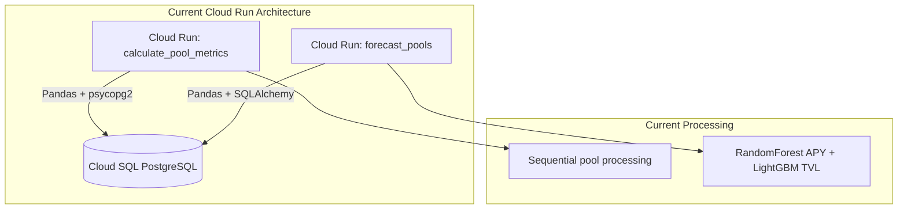
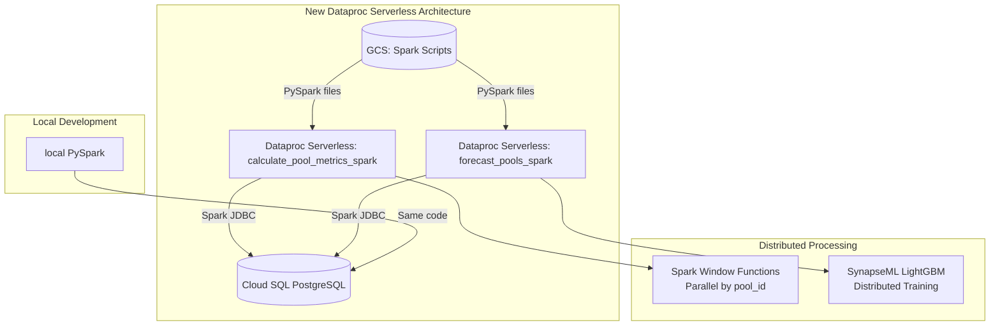
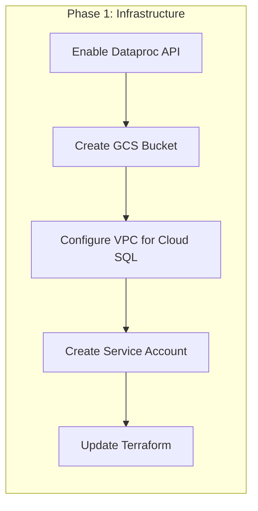
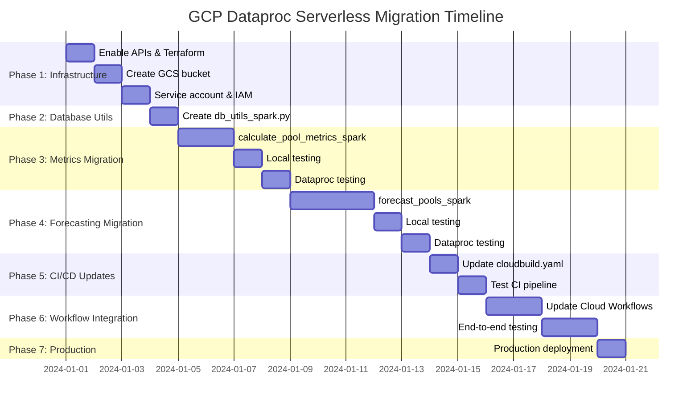

# GCP Dataproc Serverless Migration Plan

## Executive Summary

This plan outlines the migration of two compute-intensive pipeline steps (`calculate_pool_metrics` and `forecast_pools`) from Cloud Run Jobs to GCP Dataproc Serverless Spark. The migration will:
- Keep the existing local development workflow (PySpark runs locally)
- Use SynapseML for distributed LightGBM on Spark
- Connect directly to Cloud SQL via JDBC
- Maintain in-memory model training/prediction

## Current Architecture



## Target Architecture



## Technology Stack

| Component | Current | After Migration |
|-----------|---------|-----------------|
| Compute | Cloud Run Jobs | Dataproc Serverless Spark |
| Data Processing | Pandas | PySpark DataFrames |
| ML Framework | scikit-learn + LightGBM | Spark MLlib + SynapseML |
| Database Access | psycopg2 + SQLAlchemy | Spark JDBC |
| Local Development | Python scripts | PySpark (local mode) |

## Migration Candidates Analysis

### 1. `calculate_pool_metrics.py` ✅ **Excellent Candidate**

**Current Implementation ([`calculate_pool_metrics.py`](../data_processing/calculate_pool_metrics.py)):**
- Fetches pool history from `raw_defillama_pool_history` 
- Calculates rolling metrics (7d, 30d windows) per pool
- Joins with exogenous data (ETH, BTC prices, gas fees)
- Bulk inserts ~100k+ records using psycopg2

**Why it's a good candidate:**
- Rolling window calculations parallelize excellently with Spark Window functions
- Data volume is growing (365 days × N pools)
- Current sequential processing is slow

**Spark Migration Approach:**
- Use `Window.partitionBy("pool_id").orderBy("date")` for rolling calculations
- Native Spark aggregations replace pandas groupby
- JDBC writes with batch size optimization

### 2. `forecast_pools.py` ✅ **Good Candidate**

**Current Implementation ([`forecast_pools.py`](../forecasting/forecast_pools.py) → [`global_forecasting.py`](../forecasting/global_forecasting.py)):**
- Panel dataset construction (60-day training window)
- Optuna-tuned RandomForest for APY prediction
- LightGBM for TVL stacking
- Feature engineering with neighbor features

**Why it's a good candidate:**
- Feature engineering across pools benefits from distributed computation
- SynapseML LightGBM scales well for training
- Panel data construction is embarrassingly parallel

**Spark Migration Approach:**
- Panel dataset built with Spark SQL joins
- SynapseML LightGBMRegressor replaces sklearn LightGBM
- Spark MLlib RandomForestRegressor replaces sklearn (or keep SynapseML LightGBM for both)

### 3. Other Potential Candidates (Future)

| Step | Current Runtime | Parallelization Potential | Recommendation |
|------|----------------|---------------------------|----------------|
| `fetch_filtered_pool_histories` | API-bound | Low | Keep as Cloud Run |
| `apply_pool_grouping` | Fast | Medium | Defer |
| `optimize_allocations` | CPU-bound | Medium | Future candidate |

---

## Detailed Implementation Plan

### Phase 1: Infrastructure Setup



**Tasks:**

#### 1.1 Enable APIs
```bash
gcloud services enable dataproc.googleapis.com
gcloud services enable dataprocmetastore.googleapis.com
```

#### 1.2 GCS Bucket for Spark
Create a bucket for:
- PySpark script files
- Spark staging/temp files
- Job artifacts

#### 1.3 Networking
- Ensure Dataproc Serverless can reach Cloud SQL private IP
- Dataproc Serverless uses the same VPC as Cloud Run
- No additional networking changes needed (same VPC egress)

#### 1.4 Terraform Updates

**New file: `terraform/dataproc.tf`**

```hcl
# Enable Dataproc API
resource "google_project_service" "dataproc_api" {
  project = var.project_id
  service = "dataproc.googleapis.com"
}

# GCS bucket for Spark staging and scripts
resource "google_storage_bucket" "spark_staging" {
  name          = "${var.project_id}-spark-staging"
  location      = var.region
  force_destroy = true
  
  uniform_bucket_level_access = true
  
  lifecycle_rule {
    condition {
      age = 7  # Clean up old staging files after 7 days
    }
    action {
      type = "Delete"
    }
  }
}

# Service account for Dataproc Serverless
resource "google_service_account" "dataproc_sa" {
  account_id   = "dataproc-spark-sa"
  display_name = "Dataproc Serverless Service Account"
}

# Grant necessary permissions
resource "google_project_iam_member" "dataproc_worker" {
  project = var.project_id
  role    = "roles/dataproc.worker"
  member  = "serviceAccount:${google_service_account.dataproc_sa.email}"
}

resource "google_project_iam_member" "dataproc_storage" {
  project = var.project_id
  role    = "roles/storage.objectAdmin"
  member  = "serviceAccount:${google_service_account.dataproc_sa.email}"
}

resource "google_project_iam_member" "dataproc_sql" {
  project = var.project_id
  role    = "roles/cloudsql.client"
  member  = "serviceAccount:${google_service_account.dataproc_sa.email}"
}

resource "google_storage_bucket_iam_member" "dataproc_bucket_access" {
  bucket = google_storage_bucket.spark_staging.name
  role   = "roles/storage.objectAdmin"
  member = "serviceAccount:${google_service_account.dataproc_sa.email}"
}

# Grant Secret Manager access for DB credentials
resource "google_secret_manager_secret_iam_member" "dataproc_db_password" {
  secret_id = google_secret_manager_secret.db_password.secret_id
  role      = "roles/secretmanager.secretAccessor"
  member    = "serviceAccount:${google_service_account.dataproc_sa.email}"
}

# Output configuration for Dataproc batch jobs
output "dataproc_config" {
  value = {
    service_account  = google_service_account.dataproc_sa.email
    staging_bucket   = google_storage_bucket.spark_staging.name
    network          = "default"
    subnetwork       = "default"
    spark_packages   = "com.microsoft.azure:synapseml_2.12:1.0.4,org.postgresql:postgresql:42.6.0"
  }
}
```

---

### Phase 2: Database Utilities for Spark

**New file: `database/db_utils_spark.py`**

```python
"""
Spark-compatible database utilities for Dataproc Serverless.
Provides JDBC connectivity to Cloud SQL PostgreSQL.

This module mirrors the interface of db_utils.py but for Spark DataFrames.
Works both locally (PySpark local mode) and on Dataproc Serverless.
"""
import os
import logging
from typing import Optional
from pyspark.sql import SparkSession, DataFrame

logger = logging.getLogger(__name__)

def get_spark_session(app_name: str = "DefiPipeline") -> SparkSession:
    """
    Get or create SparkSession with SynapseML and JDBC support.
    Works both locally and on Dataproc Serverless.
    
    In local mode: Uses local[*] master
    In Dataproc: Uses cluster-provided SparkSession
    """
    builder = SparkSession.builder \
        .appName(app_name) \
        .config("spark.jars.packages", 
                "com.microsoft.azure:synapseml_2.12:1.0.4,"
                "org.postgresql:postgresql:42.6.0") \
        .config("spark.sql.adaptive.enabled", "true") \
        .config("spark.sql.adaptive.coalescePartitions.enabled", "true") \
        .config("spark.sql.shuffle.partitions", "auto")
    
    # Local mode detection
    environment = os.getenv("ENVIRONMENT", "production")
    if environment in ("local", "development"):
        builder = builder.master("local[*]")
        logger.info("Initializing Spark in LOCAL mode")
    else:
        logger.info("Initializing Spark in CLUSTER mode")
    
    return builder.getOrCreate()


def get_jdbc_properties() -> dict:
    """Get JDBC connection properties from environment."""
    return {
        "user": os.getenv("DB_USER"),
        "password": os.getenv("DB_PASSWORD"),
        "driver": "org.postgresql.Driver",
        "batchsize": "10000",
        "fetchsize": "10000",
        "reWriteBatchedInserts": "true"  # PostgreSQL optimization
    }


def get_jdbc_url() -> str:
    """Get JDBC URL for Cloud SQL."""
    host = os.getenv("DB_HOST")
    port = os.getenv("DB_PORT", "5432")
    db = os.getenv("DB_NAME")
    return f"jdbc:postgresql://{host}:{port}/{db}"


def read_table_spark(spark: SparkSession, 
                     table_name: Optional[str] = None,
                     query: Optional[str] = None,
                     partition_column: Optional[str] = None,
                     num_partitions: int = 10) -> DataFrame:
    """
    Read table or query result as Spark DataFrame.
    
    Args:
        spark: SparkSession instance
        table_name: Name of table to read (mutually exclusive with query)
        query: SQL query to execute (mutually exclusive with table_name)
        partition_column: Column to use for parallel reads (optional)
        num_partitions: Number of partitions for parallel reads
        
    Returns:
        Spark DataFrame
    """
    reader = spark.read.format("jdbc") \
        .option("url", get_jdbc_url()) \
        .options(**get_jdbc_properties())
    
    if query:
        reader = reader.option("dbtable", f"({query}) AS subquery")
    elif table_name:
        reader = reader.option("dbtable", table_name)
    else:
        raise ValueError("Either table_name or query must be provided")
    
    # Add partitioning for large tables
    if partition_column:
        reader = reader \
            .option("partitionColumn", partition_column) \
            .option("numPartitions", str(num_partitions))
    
    return reader.load()


def write_table_spark(df: DataFrame, 
                      table_name: str, 
                      mode: str = "overwrite"):
    """
    Write DataFrame to PostgreSQL table.
    
    Args:
        df: Spark DataFrame to write
        table_name: Target table name
        mode: Write mode - 'overwrite', 'append', 'ignore', 'error'
    """
    df.write.format("jdbc") \
        .option("url", get_jdbc_url()) \
        .options(**get_jdbc_properties()) \
        .option("dbtable", table_name) \
        .mode(mode) \
        .save()
    
    logger.info(f"Successfully wrote {df.count()} rows to {table_name}")


def execute_sql(sql: str):
    """
    Execute SQL statement directly on the database.
    Uses standard SQLAlchemy connection for DDL/DML operations.
    """
    from database.db_utils import get_db_connection
    from sqlalchemy import text
    
    engine = get_db_connection()
    with engine.connect() as conn:
        conn.execute(text(sql))
        conn.commit()
```

---

### Phase 3: Migrate `calculate_pool_metrics`

**New file: `data_processing/calculate_pool_metrics_spark.py`**

```python
"""
Spark implementation of calculate_pool_metrics.
Uses Spark Window functions for distributed rolling calculations.

This replaces the pandas-based implementation for production use on Dataproc.
The same code can run locally via PySpark in local mode.
"""
import logging
import os
from datetime import date
from pyspark.sql import SparkSession, Window
from pyspark.sql import functions as F
from pyspark.sql.types import DoubleType, DateType

from database.db_utils_spark import (
    get_spark_session, 
    read_table_spark, 
    write_table_spark,
    execute_sql
)

logging.basicConfig(level=logging.INFO, format='%(asctime)s - %(levelname)s - %(message)s')
logger = logging.getLogger(__name__)


def fetch_pool_history_spark(spark: SparkSession):
    """Fetch pool history with active pools using Spark JDBC."""
    
    query = """
    SELECT 
        h.pool_id,
        DATE(h.timestamp) as date,
        (h.raw_json_data->>'apy')::numeric AS apy,
        (h.raw_json_data->>'tvlUsd')::numeric AS tvl_usd
    FROM raw_defillama_pool_history h
    JOIN pools p ON h.pool_id = p.pool_id
    WHERE p.is_active = TRUE
    ORDER BY h.pool_id, h.timestamp
    """
    
    logger.info("Fetching pool history from database...")
    df = read_table_spark(spark, query=query)
    logger.info(f"Fetched {df.count()} pool history records")
    
    return df


def fetch_exogenous_data_spark(spark: SparkSession):
    """Fetch ETH, BTC prices and gas fees as Spark DataFrames."""
    
    # ETH prices with lag for open price
    eth_query = """
    WITH daily_data AS (
        SELECT
            data_timestamp::date as date,
            (raw_json_data->'USD'->>'close')::numeric AS close_price
        FROM raw_coinmarketcap_ohlcv
        WHERE symbol = 'ETH'
    )
    SELECT 
        date,
        LAG(close_price, 1) OVER (ORDER BY date) as eth_open
    FROM daily_data
    """
    eth_df = read_table_spark(spark, query=eth_query)
    
    # BTC prices with lag for open price
    btc_query = """
    WITH daily_data AS (
        SELECT
            data_timestamp::date as date,
            (raw_json_data->'USD'->>'close')::numeric AS close_price
        FROM raw_coinmarketcap_ohlcv
        WHERE symbol = 'BTC'
    )
    SELECT 
        date,
        LAG(close_price, 1) OVER (ORDER BY date) as btc_open
    FROM daily_data
    """
    btc_df = read_table_spark(spark, query=btc_query)
    
    # Gas fees
    gas_query = """
    SELECT 
        date,
        actual_avg_gas_gwei as gas_price_gwei
    FROM gas_fees_daily
    """
    gas_df = read_table_spark(spark, query=gas_query)
    
    # Join all exogenous data
    exog_df = eth_df \
        .join(btc_df, "date", "outer") \
        .join(gas_df, "date", "outer")
    
    logger.info(f"Fetched exogenous data with {exog_df.count()} date records")
    return exog_df


def calculate_rolling_metrics_spark(history_df):
    """
    Calculate rolling metrics using Spark Window functions.
    
    This is the core optimization - Spark parallelizes these calculations
    across all pools simultaneously using Window partitions.
    """
    
    # Define window specifications
    # Window for 7-day rolling calculations (current row + 6 preceding)
    window_7d = Window.partitionBy("pool_id") \
                      .orderBy("date") \
                      .rowsBetween(-6, 0)
    
    # Window for 30-day rolling calculations
    window_30d = Window.partitionBy("pool_id") \
                       .orderBy("date") \
                       .rowsBetween(-29, 0)
    
    # Window for lag calculations (previous row)
    window_lag = Window.partitionBy("pool_id").orderBy("date")
    
    logger.info("Calculating rolling metrics...")
    
    metrics_df = history_df \
        .withColumn("rolling_apy_7d", 
                   F.avg("apy").over(window_7d)) \
        .withColumn("rolling_apy_30d", 
                   F.avg("apy").over(window_30d)) \
        .withColumn("stddev_apy_7d", 
                   F.stddev("apy").over(window_7d)) \
        .withColumn("stddev_apy_30d", 
                   F.stddev("apy").over(window_30d)) \
        .withColumn("apy_delta_today_yesterday", 
                   F.col("apy") - F.lag("apy", 1).over(window_lag)) \
        .withColumn("stddev_apy_7d_delta",
                   F.col("stddev_apy_7d") - F.lag("stddev_apy_7d", 1).over(window_lag)) \
        .withColumn("stddev_apy_30d_delta",
                   F.col("stddev_apy_30d") - F.lag("stddev_apy_30d", 1).over(window_lag))
    
    return metrics_df


def forward_fill_exogenous(df, columns):
    """
    Forward fill null values in exogenous columns per pool.
    Uses Spark's last() with ignorenulls=True over a window.
    """
    window_ffill = Window.partitionBy("pool_id") \
                         .orderBy("date") \
                         .rowsBetween(Window.unboundedPreceding, 0)
    
    for col_name in columns:
        df = df.withColumn(
            col_name, 
            F.last(col_name, ignorenulls=True).over(window_ffill)
        )
    
    return df


def write_metrics_with_upsert(spark: SparkSession, metrics_df):
    """
    Write metrics to database using staging table + upsert pattern.
    This handles the ON CONFLICT logic that Spark JDBC doesn't support directly.
    """
    
    # First, write to a staging table
    staging_table = "pool_daily_metrics_staging"
    
    logger.info(f"Writing {metrics_df.count()} records to staging table...")
    write_table_spark(metrics_df, staging_table, mode="overwrite")
    
    # Execute upsert via direct SQL
    upsert_sql = """
    INSERT INTO pool_daily_metrics (
        pool_id, date, actual_apy, forecasted_apy, actual_tvl, forecasted_tvl,
        rolling_apy_7d, rolling_apy_30d, apy_delta_today_yesterday,
        stddev_apy_7d, stddev_apy_30d, stddev_apy_7d_delta, stddev_apy_30d_delta,
        eth_open, btc_open, gas_price_gwei
    )
    SELECT 
        pool_id, date, actual_apy, forecasted_apy, actual_tvl, forecasted_tvl,
        rolling_apy_7d, rolling_apy_30d, apy_delta_today_yesterday,
        stddev_apy_7d, stddev_apy_30d, stddev_apy_7d_delta, stddev_apy_30d_delta,
        eth_open, btc_open, gas_price_gwei
    FROM pool_daily_metrics_staging
    ON CONFLICT (pool_id, date) DO UPDATE SET
        actual_apy = EXCLUDED.actual_apy,
        actual_tvl = EXCLUDED.actual_tvl,
        rolling_apy_7d = EXCLUDED.rolling_apy_7d,
        rolling_apy_30d = EXCLUDED.rolling_apy_30d,
        apy_delta_today_yesterday = EXCLUDED.apy_delta_today_yesterday,
        stddev_apy_7d = EXCLUDED.stddev_apy_7d,
        stddev_apy_30d = EXCLUDED.stddev_apy_30d,
        stddev_apy_7d_delta = EXCLUDED.stddev_apy_7d_delta,
        stddev_apy_30d_delta = EXCLUDED.stddev_apy_30d_delta,
        eth_open = EXCLUDED.eth_open,
        btc_open = EXCLUDED.btc_open,
        gas_price_gwei = EXCLUDED.gas_price_gwei;
    """
    
    logger.info("Executing upsert from staging to main table...")
    execute_sql(upsert_sql)
    
    # Clean up staging table
    execute_sql(f"DROP TABLE IF EXISTS {staging_table}")
    logger.info("Upsert completed and staging table cleaned up")


def calculate_pool_metrics_spark():
    """
    Main entry point for Spark-based pool metrics calculation.
    
    This function orchestrates the entire metrics calculation pipeline:
    1. Fetch pool history and exogenous data
    2. Join and forward-fill exogenous data
    3. Calculate rolling metrics using Window functions
    4. Write results with upsert logic
    """
    logger.info("="*60)
    logger.info("📊 STARTING SPARK POOL METRICS CALCULATION")
    logger.info("="*60)
    
    spark = None
    try:
        # Initialize Spark
        spark = get_spark_session("CalculatePoolMetrics")
        
        # 1. Fetch data
        history_df = fetch_pool_history_spark(spark)
        exog_df = fetch_exogenous_data_spark(spark)
        
        # 2. Join pool history with exogenous data
        logger.info("Joining pool history with exogenous data...")
        joined_df = history_df.join(exog_df, "date", "left")
        
        # 3. Forward fill exogenous data per pool
        logger.info("Forward filling exogenous data...")
        filled_df = forward_fill_exogenous(
            joined_df, 
            ["eth_open", "btc_open", "gas_price_gwei"]
        )
        
        # 4. Calculate rolling metrics
        metrics_df = calculate_rolling_metrics_spark(filled_df)
        
        # 5. Prepare final output schema
        output_df = metrics_df.select(
            "pool_id", 
            "date",
            F.col("apy").alias("actual_apy"),
            F.lit(None).cast(DoubleType()).alias("forecasted_apy"),
            F.col("tvl_usd").alias("actual_tvl"),
            F.lit(None).cast(DoubleType()).alias("forecasted_tvl"),
            "rolling_apy_7d", 
            "rolling_apy_30d",
            "apy_delta_today_yesterday",
            "stddev_apy_7d", 
            "stddev_apy_30d",
            "stddev_apy_7d_delta", 
            "stddev_apy_30d_delta",
            "eth_open", 
            "btc_open", 
            "gas_price_gwei"
        )
        
        # 6. Write to database
        write_metrics_with_upsert(spark, output_df)
        
        # Print summary
        pool_count = output_df.select("pool_id").distinct().count()
        record_count = output_df.count()
        
        logger.info("="*60)
        logger.info("📊 SPARK POOL METRICS CALCULATION SUMMARY")
        logger.info("="*60)
        logger.info(f"📥 Total pools processed: {pool_count}")
        logger.info(f"📈 Total records written: {record_count}")
        logger.info(f"💾 Data written to: pool_daily_metrics")
        logger.info(f"📅 Date: {date.today()}")
        logger.info("✅ Spark pool metrics calculation completed successfully")
        logger.info("="*60)
        
    except Exception as e:
        logger.error(f"Error during Spark pool metrics calculation: {e}")
        logger.error("="*60)
        logger.error("❌ SPARK POOL METRICS CALCULATION FAILED")
        logger.error("="*60)
        raise
        
    finally:
        if spark:
            spark.stop()


if __name__ == "__main__":
    calculate_pool_metrics_spark()
```

---

### Phase 4: Migrate `forecast_pools`

**New file: `forecasting/forecast_pools_spark.py`**

```python
"""
Spark implementation of global forecasting with SynapseML LightGBM.

This replaces the pandas/sklearn-based implementation for production use.
Uses SynapseML's LightGBMRegressor for distributed ML training.
"""
import logging
import os
from datetime import date
from pyspark.sql import SparkSession, Window
from pyspark.sql import functions as F
from pyspark.ml.feature import VectorAssembler, StringIndexer
from pyspark.ml import Pipeline

# SynapseML imports - these work via spark.jars.packages config
from synapse.ml.lightgbm import LightGBMRegressor

from database.db_utils_spark import (
    get_spark_session,
    read_table_spark,
    write_table_spark,
    execute_sql
)

logging.basicConfig(level=logging.INFO, format='%(asctime)s - %(levelname)s - %(message)s')
logger = logging.getLogger(__name__)

# Feature columns for the model
FEATURE_COLS = [
    'rolling_apy_7d', 'rolling_apy_30d', 
    'stddev_apy_7d', 'stddev_apy_30d',
    'apy_delta_today_yesterday', 
    'eth_open', 'btc_open', 'gas_price_gwei',
    'actual_tvl', 
    'pool_group_idx',
    'dow_sin', 'dow_cos',
    # Neighbor features
    'group_tvl_sum', 'group_apy_mean', 'group_apy_std', 'tvl_share'
]


def build_panel_dataset_spark(spark: SparkSession, train_days: int = 60):
    """
    Build panel dataset for training using Spark SQL.
    
    This fetches the last N days of metrics for all non-filtered pools
    and prepares the features for model training.
    """
    
    query = f"""
    SELECT 
        m.pool_id, 
        m.date,
        m.actual_apy, 
        m.actual_tvl,
        m.rolling_apy_7d, 
        m.rolling_apy_30d,
        m.stddev_apy_7d, 
        m.stddev_apy_30d,
        m.apy_delta_today_yesterday,
        m.eth_open, 
        m.btc_open, 
        m.gas_price_gwei,
        m.pool_group
    FROM pool_daily_metrics m
    WHERE m.is_filtered_out = FALSE
      AND m.date >= CURRENT_DATE - INTERVAL '{train_days} days'
      AND m.actual_apy IS NOT NULL
    ORDER BY m.pool_id, m.date
    """
    
    logger.info(f"Building panel dataset with {train_days} days of history...")
    panel_df = read_table_spark(spark, query=query)
    
    # Add calendar features (cyclical encoding)
    panel_df = panel_df \
        .withColumn("dow", F.dayofweek("date")) \
        .withColumn("dow_sin", F.sin(2 * 3.14159 * F.col("dow") / 7)) \
        .withColumn("dow_cos", F.cos(2 * 3.14159 * F.col("dow") / 7))
    
    # Create target: next day APY using lead window
    window_spec = Window.partitionBy("pool_id").orderBy("date")
    panel_df = panel_df.withColumn(
        "target_apy_t1", 
        F.lead("actual_apy", 1).over(window_spec)
    )
    
    # Encode pool_group as numeric
    indexer = StringIndexer(
        inputCol="pool_group", 
        outputCol="pool_group_idx",
        handleInvalid="keep"
    )
    panel_df = indexer.fit(panel_df).transform(panel_df)
    
    # Filter out rows without target (last day of each pool)
    panel_df = panel_df.filter(F.col("target_apy_t1").isNotNull())
    
    logger.info(f"Panel dataset built with {panel_df.count()} training records")
    return panel_df


def add_neighbor_features_spark(panel_df):
    """
    Add group-level neighbor features using Spark aggregations.
    
    These features capture the behavior of similar pools in the same group,
    providing valuable signals for prediction.
    """
    
    # Calculate group-level statistics per date
    group_stats = panel_df.groupBy("date", "pool_group").agg(
        F.sum("actual_tvl").alias("group_tvl_sum"),
        F.avg("rolling_apy_7d").alias("group_apy_mean"),
        F.stddev("rolling_apy_7d").alias("group_apy_std"),
        F.count("*").alias("group_pool_count")
    )
    
    # Join back to main dataframe
    panel_with_neighbors = panel_df.join(
        group_stats,
        ["date", "pool_group"],
        "left"
    )
    
    # Calculate pool's TVL share within group
    panel_with_neighbors = panel_with_neighbors.withColumn(
        "tvl_share",
        F.when(F.col("group_tvl_sum") > 0,
               F.col("actual_tvl") / F.col("group_tvl_sum"))
        .otherwise(0.0)
    )
    
    logger.info("Added neighbor features to panel dataset")
    return panel_with_neighbors


def train_lgbm_model_spark(train_df, feature_cols):
    """
    Train SynapseML LightGBM model on Spark.
    
    This uses the distributed LightGBM implementation from SynapseML,
    which trains the model across all Spark executors.
    """
    
    # Filter to only include rows with all features present
    for col in feature_cols:
        if col in train_df.columns:
            train_df = train_df.withColumn(
                col, 
                F.coalesce(F.col(col), F.lit(0.0))
            )
    
    # Assemble features into a vector
    assembler = VectorAssembler(
        inputCols=[c for c in feature_cols if c in train_df.columns],
        outputCol="features",
        handleInvalid="skip"
    )
    
    # SynapseML LightGBM Regressor
    lgbm = LightGBMRegressor(
        objective="regression",
        numLeaves=64,
        learningRate=0.03,
        numIterations=800,
        labelCol="target_apy_t1",
        featuresCol="features",
        predictionCol="pred_apy",
        verbosity=-1
    )
    
    # Create pipeline
    pipeline = Pipeline(stages=[assembler, lgbm])
    
    logger.info(f"Training LightGBM model with {len(feature_cols)} features...")
    model = pipeline.fit(train_df)
    logger.info("Model training completed")
    
    return model


def persist_forecasts_spark(spark: SparkSession, predictions_df):
    """
    Persist forecasts to database using staging + update pattern.
    """
    
    # Select only needed columns
    output_df = predictions_df.select(
        "pool_id",
        F.date_add("date", 1).alias("forecast_date"),
        F.col("pred_apy").alias("forecasted_apy")
    )
    
    # Write to staging
    staging_table = "forecast_staging"
    write_table_spark(output_df, staging_table, mode="overwrite")
    
    # Update main table
    update_sql = """
    UPDATE pool_daily_metrics m
    SET forecasted_apy = s.forecasted_apy
    FROM forecast_staging s
    WHERE m.pool_id = s.pool_id 
      AND m.date = s.forecast_date;
    """
    
    logger.info("Updating forecasts in pool_daily_metrics...")
    execute_sql(update_sql)
    
    # Clean up
    execute_sql(f"DROP TABLE IF EXISTS {staging_table}")
    logger.info(f"Persisted {output_df.count()} forecasts")


def forecast_pools_spark():
    """
    Main entry point for Spark-based global forecasting.
    
    Pipeline:
    1. Build panel dataset from pool_daily_metrics
    2. Add neighbor features
    3. Train LightGBM model
    4. Generate predictions for next day
    5. Persist forecasts to database
    """
    logger.info("="*60)
    logger.info("📊 STARTING SPARK GLOBAL FORECASTING")
    logger.info("="*60)
    
    spark = None
    try:
        # Initialize Spark
        spark = get_spark_session("ForecastPools")
        
        # 1. Build panel dataset
        panel_df = build_panel_dataset_spark(spark, train_days=60)
        
        # 2. Add neighbor features
        panel_df = add_neighbor_features_spark(panel_df)
        
        # 3. Fill nulls in feature columns
        for col in FEATURE_COLS:
            if col in panel_df.columns:
                panel_df = panel_df.fillna({col: 0.0})
        
        # 4. Train model
        model = train_lgbm_model_spark(panel_df, FEATURE_COLS)
        
        # 5. Get latest data for prediction (most recent date)
        latest_date = panel_df.agg(F.max("date")).collect()[0][0]
        logger.info(f"Generating predictions for date after: {latest_date}")
        
        predict_df = panel_df.filter(F.col("date") == latest_date)
        
        # 6. Generate predictions
        predictions = model.transform(predict_df)
        
        # 7. Persist forecasts
        persist_forecasts_spark(spark, predictions)
        
        # Summary
        total_pools = predictions.count()
        
        logger.info("="*60)
        logger.info("📊 SPARK GLOBAL FORECASTING SUMMARY")
        logger.info("="*60)
        logger.info(f"📥 Total pools forecasted: {total_pools}")
        logger.info(f"🔧 Model: SynapseML LightGBM")
        logger.info(f"🧠 Features used: {len(FEATURE_COLS)}")
        logger.info(f"📅 Forecast date: {latest_date}")
        logger.info("✅ Spark global forecasting completed successfully")
        logger.info("="*60)
        
        return {
            "total_pools": total_pools,
            "model_type": "SynapseML LightGBM",
            "feature_count": len(FEATURE_COLS)
        }
        
    except Exception as e:
        logger.error(f"Error during Spark forecasting: {e}")
        logger.error("="*60)
        logger.error("❌ SPARK GLOBAL FORECASTING FAILED")
        logger.error("="*60)
        raise
        
    finally:
        if spark:
            spark.stop()


if __name__ == "__main__":
    forecast_pools_spark()
```

---

### Phase 5: CI/CD Pipeline Updates

The Cloud Build pipeline needs to be updated to:
1. Upload PySpark scripts to GCS
2. No longer build Docker images for migrated jobs (optional cleanup)

**Updated `cloudbuild.yaml`:**

```yaml
steps:
  # ============================================
  # SPARK SCRIPTS UPLOAD TO GCS
  # ============================================
  
  # Upload PySpark scripts to GCS for Dataproc Serverless
  - name: 'gcr.io/cloud-builders/gsutil'
    entrypoint: 'bash'
    args:
      - '-c'
      - |
        echo "Uploading PySpark scripts to GCS..."
        
        # Create scripts directory structure in GCS
        gsutil -m cp -r data_processing/calculate_pool_metrics_spark.py \
          gs://${PROJECT_ID}-spark-staging/scripts/
        
        gsutil -m cp -r forecasting/forecast_pools_spark.py \
          gs://${PROJECT_ID}-spark-staging/scripts/
        
        gsutil -m cp -r database/db_utils_spark.py \
          gs://${PROJECT_ID}-spark-staging/scripts/database/
        
        gsutil -m cp -r database/db_utils.py \
          gs://${PROJECT_ID}-spark-staging/scripts/database/
        
        gsutil -m cp -r config.py \
          gs://${PROJECT_ID}-spark-staging/scripts/
        
        echo "PySpark scripts uploaded successfully"

  # ============================================
  # DOCKER IMAGE BUILDS (unchanged for non-Spark jobs)
  # ============================================
  
  # Build Web Scraping Image
  - name: 'gcr.io/cloud-builders/docker'
    entrypoint: 'bash'
    args:
      - '-c'
      - |
        docker pull gcr.io/$PROJECT_ID/defi-pipeline-web-scraping:latest || true
        docker build \
          -f dockerfiles/Dockerfile.web-scraping \
          -t gcr.io/$PROJECT_ID/defi-pipeline-web-scraping:latest \
          -t gcr.io/$PROJECT_ID/defi-pipeline-web-scraping:$COMMIT_SHA \
          --cache-from gcr.io/$PROJECT_ID/defi-pipeline-web-scraping:latest \
          .

  # Build ML/Science Image (still needed for optimize_allocations)
  - name: 'gcr.io/cloud-builders/docker'
    entrypoint: 'bash'
    args:
      - '-c'
      - |
        docker pull gcr.io/$PROJECT_ID/defi-pipeline-ml-science:latest || true
        docker build \
          -f dockerfiles/Dockerfile.ml-science \
          -t gcr.io/$PROJECT_ID/defi-pipeline-ml-science:latest \
          -t gcr.io/$PROJECT_ID/defi-pipeline-ml-science:$COMMIT_SHA \
          --cache-from gcr.io/$PROJECT_ID/defi-pipeline-ml-science:latest \
          .

  # Build Lightweight Image
  - name: 'gcr.io/cloud-builders/docker'
    entrypoint: 'bash'
    args:
      - '-c'
      - |
        docker pull gcr.io/$PROJECT_ID/defi-pipeline-lightweight:latest || true
        docker build \
          -f dockerfiles/Dockerfile.lightweight \
          -t gcr.io/$PROJECT_ID/defi-pipeline-lightweight:latest \
          -t gcr.io/$PROJECT_ID/defi-pipeline-lightweight:$COMMIT_SHA \
          --cache-from gcr.io/$PROJECT_ID/defi-pipeline-lightweight:latest \
          .

  # Build Database Image
  - name: 'gcr.io/cloud-builders/docker'
    entrypoint: 'bash'
    args:
      - '-c'
      - |
        docker pull gcr.io/$PROJECT_ID/defi-pipeline-database:latest || true
        docker build \
          -f dockerfiles/Dockerfile.database \
          -t gcr.io/$PROJECT_ID/defi-pipeline-database:latest \
          -t gcr.io/$PROJECT_ID/defi-pipeline-database:$COMMIT_SHA \
          --cache-from gcr.io/$PROJECT_ID/defi-pipeline-database:latest \
          .

  # ============================================
  # PUSH IMAGES
  # ============================================
  
  - name: 'gcr.io/cloud-builders/docker'
    args: ['push', 'gcr.io/$PROJECT_ID/defi-pipeline-web-scraping:latest']

  - name: 'gcr.io/cloud-builders/docker'
    args: ['push', 'gcr.io/$PROJECT_ID/defi-pipeline-web-scraping:$COMMIT_SHA']

  - name: 'gcr.io/cloud-builders/docker'
    args: ['push', 'gcr.io/$PROJECT_ID/defi-pipeline-ml-science:latest']

  - name: 'gcr.io/cloud-builders/docker'
    args: ['push', 'gcr.io/$PROJECT_ID/defi-pipeline-ml-science:$COMMIT_SHA']

  - name: 'gcr.io/cloud-builders/docker'
    args: ['push', 'gcr.io/$PROJECT_ID/defi-pipeline-lightweight:latest']

  - name: 'gcr.io/cloud-builders/docker'
    args: ['push', 'gcr.io/$PROJECT_ID/defi-pipeline-lightweight:$COMMIT_SHA']

  - name: 'gcr.io/cloud-builders/docker'
    args: ['push', 'gcr.io/$PROJECT_ID/defi-pipeline-database:latest']

  - name: 'gcr.io/cloud-builders/docker'
    args: ['push', 'gcr.io/$PROJECT_ID/defi-pipeline-database:$COMMIT_SHA']

  # ============================================
  # COMPLETION LOG
  # ============================================
  
  - name: 'gcr.io/cloud-builders/gcloud'
    entrypoint: 'bash'
    args:
      - '-c'
      - |
        echo "Build and push complete:"
        echo ""
        echo "📦 Docker Images:"
        echo "  - Web Scraping: gcr.io/$PROJECT_ID/defi-pipeline-web-scraping:$COMMIT_SHA"
        echo "  - ML/Science: gcr.io/$PROJECT_ID/defi-pipeline-ml-science:$COMMIT_SHA"
        echo "  - Lightweight: gcr.io/$PROJECT_ID/defi-pipeline-lightweight:$COMMIT_SHA"
        echo "  - Database: gcr.io/$PROJECT_ID/defi-pipeline-database:$COMMIT_SHA"
        echo ""
        echo "⚡ Spark Scripts (GCS):"
        echo "  - gs://${PROJECT_ID}-spark-staging/scripts/calculate_pool_metrics_spark.py"
        echo "  - gs://${PROJECT_ID}-spark-staging/scripts/forecast_pools_spark.py"
        echo ""
        echo "Dataproc Serverless jobs will use latest scripts on next execution."

images:
  - 'gcr.io/$PROJECT_ID/defi-pipeline-web-scraping:latest'
  - 'gcr.io/$PROJECT_ID/defi-pipeline-web-scraping:$COMMIT_SHA'
  - 'gcr.io/$PROJECT_ID/defi-pipeline-ml-science:latest'
  - 'gcr.io/$PROJECT_ID/defi-pipeline-ml-science:$COMMIT_SHA'
  - 'gcr.io/$PROJECT_ID/defi-pipeline-lightweight:latest'
  - 'gcr.io/$PROJECT_ID/defi-pipeline-lightweight:$COMMIT_SHA'
  - 'gcr.io/$PROJECT_ID/defi-pipeline-database:latest'
  - 'gcr.io/$PROJECT_ID/defi-pipeline-database:$COMMIT_SHA'

options:
  machineType: 'E2_HIGHCPU_8'
  logging: CLOUD_LOGGING_ONLY
```

---

### Phase 6: Cloud Workflows Integration

Update the Cloud Workflows definition to trigger Dataproc Serverless batches instead of Cloud Run Jobs for the migrated steps.

**New workflow step templates:**

```yaml
# In terraform/workflows.tf or workflow YAML

# Replace Cloud Run job call with Dataproc Serverless batch
- calculatePoolMetricsSpark:
    call: http.post
    args:
      url: ${"https://dataproc.googleapis.com/v1/projects/" + project_id + "/locations/" + region + "/batches"}
      auth:
        type: OAuth2
      body:
        batchId: ${"calculate-pool-metrics-" + string(int(sys.now()))}
        pysparkBatch:
          mainPythonFileUri: ${"gs://" + project_id + "-spark-staging/scripts/calculate_pool_metrics_spark.py"}
          pythonFileUris:
            - ${"gs://" + project_id + "-spark-staging/scripts/database/db_utils_spark.py"}
            - ${"gs://" + project_id + "-spark-staging/scripts/database/db_utils.py"}
            - ${"gs://" + project_id + "-spark-staging/scripts/config.py"}
        environmentConfig:
          executionConfig:
            serviceAccount: ${service_account}
            subnetworkUri: ${"projects/" + project_id + "/regions/" + region + "/subnetworks/default"}
        runtimeConfig:
          version: "2.1"
          properties:
            spark.jars.packages: "com.microsoft.azure:synapseml_2.12:1.0.4,org.postgresql:postgresql:42.6.0"
            spark.dynamicAllocation.enabled: "true"
            spark.executor.memory: "4g"
            spark.driver.memory: "4g"
    result: calculateMetricsResult

# Wait for batch to complete
- waitForCalculateMetrics:
    call: http.get
    args:
      url: ${calculateMetricsResult.body.name}
      auth:
        type: OAuth2
    result: batchStatus
    # Poll until completed

# Similar pattern for forecastPoolsSpark
- forecastPoolsSpark:
    call: http.post
    args:
      url: ${"https://dataproc.googleapis.com/v1/projects/" + project_id + "/locations/" + region + "/batches"}
      auth:
        type: OAuth2
      body:
        batchId: ${"forecast-pools-" + string(int(sys.now()))}
        pysparkBatch:
          mainPythonFileUri: ${"gs://" + project_id + "-spark-staging/scripts/forecast_pools_spark.py"}
          pythonFileUris:
            - ${"gs://" + project_id + "-spark-staging/scripts/database/db_utils_spark.py"}
            - ${"gs://" + project_id + "-spark-staging/scripts/database/db_utils.py"}
            - ${"gs://" + project_id + "-spark-staging/scripts/config.py"}
        environmentConfig:
          executionConfig:
            serviceAccount: ${service_account}
            subnetworkUri: ${"projects/" + project_id + "/regions/" + region + "/subnetworks/default"}
        runtimeConfig:
          version: "2.1"
          properties:
            spark.jars.packages: "com.microsoft.azure:synapseml_2.12:1.0.4,org.postgresql:postgresql:42.6.0"
            spark.dynamicAllocation.enabled: "true"
            spark.executor.memory: "8g"
            spark.driver.memory: "8g"
    result: forecastResult
```

---

### Phase 7: Local Development Support

**New file: `run_spark_local.py`**

```python
#!/usr/bin/env python3
"""
Local Spark runner for development.
Sets up local Spark environment to run the same code that runs on Dataproc.

Usage:
    python run_spark_local.py calculate_metrics
    python run_spark_local.py forecast_pools
    
Prerequisites:
    - Java 8 or 11 installed
    - PySpark installed: pip install pyspark
    - SynapseML: pip install synapseml
    - PostgreSQL JDBC driver (downloaded automatically by Spark)
"""
import os
import sys
import logging

# Configure logging
logging.basicConfig(
    level=logging.INFO,
    format='%(asctime)s - %(levelname)s - %(message)s'
)
logger = logging.getLogger(__name__)

# Set environment for local mode
os.environ["ENVIRONMENT"] = "local"

# Load .env file if it exists
from dotenv import load_dotenv
load_dotenv()

# Verify required environment variables
REQUIRED_VARS = ["DB_HOST", "DB_PORT", "DB_NAME", "DB_USER", "DB_PASSWORD"]
missing_vars = [v for v in REQUIRED_VARS if not os.getenv(v)]
if missing_vars:
    logger.error(f"Missing required environment variables: {missing_vars}")
    logger.error("Please set them in .env file or export them")
    sys.exit(1)


def run_calculate_metrics():
    """Run the Spark-based calculate_pool_metrics job locally."""
    logger.info("Running calculate_pool_metrics_spark locally...")
    from data_processing.calculate_pool_metrics_spark import calculate_pool_metrics_spark
    calculate_pool_metrics_spark()


def run_forecast_pools():
    """Run the Spark-based forecast_pools job locally."""
    logger.info("Running forecast_pools_spark locally...")
    from forecasting.forecast_pools_spark import forecast_pools_spark
    forecast_pools_spark()


def main():
    if len(sys.argv) < 2:
        print("Usage: python run_spark_local.py <job_name>")
        print("")
        print("Available jobs:")
        print("  calculate_metrics  - Run pool metrics calculation")
        print("  forecast_pools     - Run global forecasting")
        sys.exit(1)
    
    job = sys.argv[1]
    
    if job == "calculate_metrics":
        run_calculate_metrics()
    elif job == "forecast_pools":
        run_forecast_pools()
    else:
        print(f"Unknown job: {job}")
        print("Available jobs: calculate_metrics, forecast_pools")
        sys.exit(1)


if __name__ == "__main__":
    main()
```

**New file: `requirements-spark.txt`**

```
# PySpark and related dependencies for local development
pyspark>=3.3.0,<3.6.0
py4j>=0.10.9

# SynapseML for distributed LightGBM
synapseml==1.0.4

# Standard data science libraries
pandas>=1.5.0
numpy>=1.21.0

# Database connectivity
psycopg2-binary>=2.9.0
sqlalchemy>=2.0.0

# Configuration
python-dotenv>=1.0.0
```

---

## File Structure After Migration

```
StablecoinPoolOpt/
├── data_processing/
│   ├── calculate_pool_metrics.py          # Existing (keep as fallback)
│   └── calculate_pool_metrics_spark.py    # NEW: Spark implementation
├── forecasting/
│   ├── forecast_pools.py                  # Existing (keep as fallback)
│   ├── forecast_pools_spark.py            # NEW: Spark implementation
│   ├── global_forecasting.py              # Existing
│   └── ...
├── database/
│   ├── db_utils.py                        # Existing SQLAlchemy utilities
│   └── db_utils_spark.py                  # NEW: Spark JDBC utilities
├── terraform/
│   ├── cloud_run.tf                       # Existing (minor updates)
│   ├── dataproc.tf                        # NEW: Dataproc Serverless config
│   ├── workflows.tf                       # Updated: call Dataproc batches
│   └── ...
├── cloudbuild.yaml                        # Updated: add GCS upload step
├── run_spark_local.py                     # NEW: Local development runner
├── requirements.txt                       # Existing
└── requirements-spark.txt                 # NEW: Spark-specific deps
```

---

## Migration Timeline



**Estimated Total Duration: ~2-3 weeks**

---

## Cost Analysis

| Resource | Current (Cloud Run) | Projected (Dataproc Serverless) |
|----------|--------------------|---------------------------------|
| calculate_pool_metrics | ~$5-10/month | ~$10-15/month |
| forecast_pools | ~$10-20/month | ~$20-35/month |
| GCS Storage | N/A | ~$1-2/month |
| **Total** | ~$15-30/month | ~$31-52/month |

**Notes:**
- Dataproc Serverless bills per DCU-second (Data Compute Unit)
- Costs scale with job duration and cluster size
- Benefits: Better parallelization, potentially faster execution
- Can optimize by tuning executor count and memory

---

## Rollback Plan

If issues arise during or after migration:

1. **Cloud Run jobs remain available** - Original Terraform configs are preserved
2. **Original Python scripts kept** - `calculate_pool_metrics.py` and `forecast_pools.py` unchanged
3. **Workflow can switch back** - Update workflow to call Cloud Run instead of Dataproc
4. **Database schema unchanged** - No migration required, same tables used
5. **Quick rollback procedure:**
   ```bash
   # In workflows.tf, change:
   # calculatePoolMetricsSpark -> calculatePoolMetrics (Cloud Run)
   # forecastPoolsSpark -> forecastPools (Cloud Run)
   terraform apply
   ```

---

## Testing Checklist

### Local Testing
- [ ] `python run_spark_local.py calculate_metrics` runs successfully
- [ ] `python run_spark_local.py forecast_pools` runs successfully
- [ ] Metrics match original implementation (within tolerance)
- [ ] Forecasts match original implementation (within tolerance)

### Dataproc Testing
- [ ] Scripts upload to GCS correctly via Cloud Build
- [ ] Dataproc batch jobs start successfully
- [ ] VPC connectivity to Cloud SQL works
- [ ] Jobs complete without errors
- [ ] Data written to database correctly

### Integration Testing
- [ ] Cloud Workflows trigger Dataproc batches
- [ ] Job status polling works correctly
- [ ] Error handling and retries function
- [ ] End-to-end pipeline completes successfully

### Performance Testing
- [ ] Job execution time is acceptable
- [ ] Memory usage within limits
- [ ] No data quality regressions

---

## Appendix: SynapseML Configuration Notes

SynapseML requires specific configuration for LightGBM on Spark:

1. **JAR packages** (added via `spark.jars.packages`):
   - `com.microsoft.azure:synapseml_2.12:1.0.4`
   - `org.postgresql:postgresql:42.6.0`

2. **Python package** (for local development):
   - `pip install synapseml==1.0.4`

3. **Compatibility**:
   - Requires Spark 3.2+ 
   - Works with Python 3.8+
   - Dataproc runtime 2.1 includes compatible Spark version

4. **Key differences from sklearn LightGBM**:
   - Uses `featuresCol` instead of passing arrays directly
   - Requires VectorAssembler for feature engineering
   - Model serialization uses Spark MLlib format