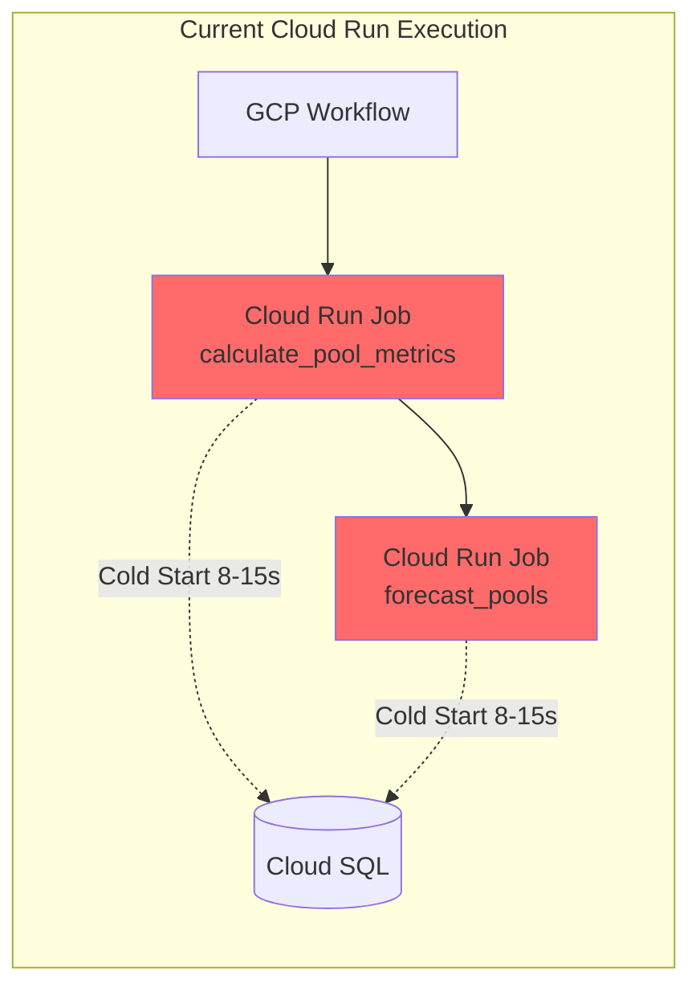
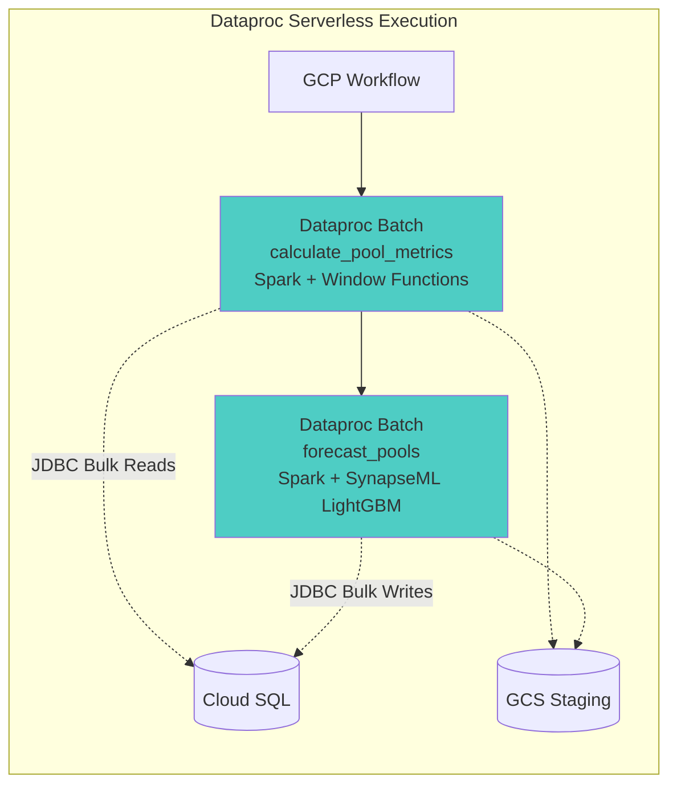
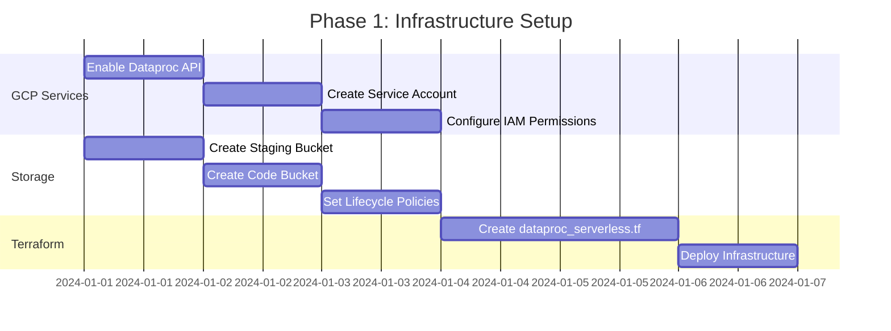
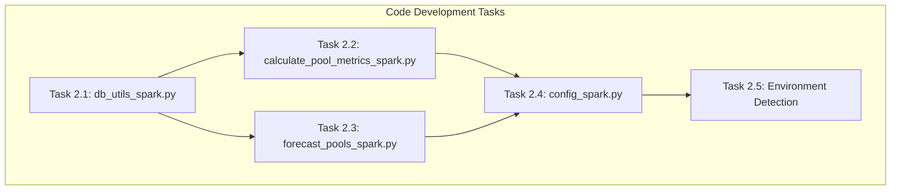
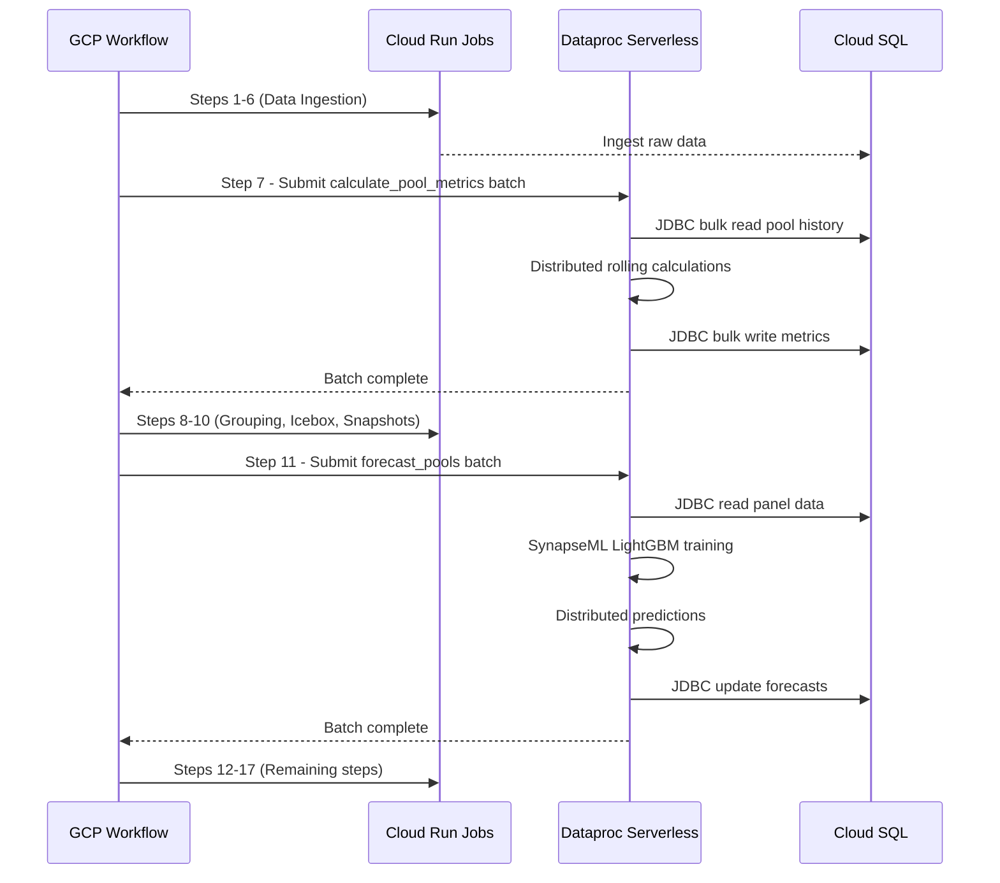
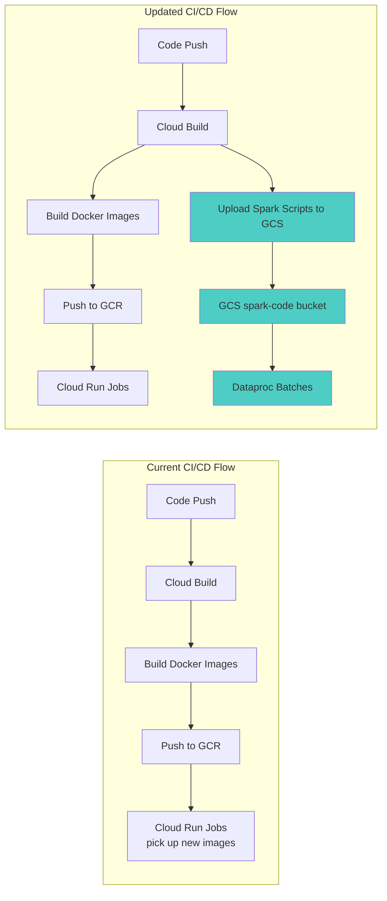

# Dataproc Serverless Migration Plan for Heavy Processing

## Executive Summary

This plan provides a comprehensive roadmap to migrate the two most compute-intensive pipeline steps—[`calculate_pool_metrics.py`](../data_processing/calculate_pool_metrics.py) and [`forecast_pools.py`](../forecasting/forecast_pools.py)—from Cloud Run Jobs to **GCP Dataproc Serverless** using **SynapseML LightGBM** for distributed processing. This migration addresses the performance bottleneck identified in the [Cloud Run Performance Optimization Investigation](./cloud_run_performance_optimization.md) (Recommendation #7) by enabling distributed computing on large datasets.

## Table of Contents

1. [Current State Analysis](#current-state-analysis)
2. [Target Architecture](#target-architecture)
3. [Implementation Phases](#implementation-phases)
   - [Phase 1: Infrastructure Setup](#phase-1-infrastructure-setup-week-1)
   - [Phase 2: Code Development](#phase-2-code-development-weeks-2-3)
   - [Phase 3: Workflow Integration](#phase-3-workflow-integration-week-4)
   - [Phase 4: Testing & Validation](#phase-4-testing--validation-week-5)
   - [Phase 5: Monitoring & Optimization](#phase-5-monitoring--optimization-ongoing)
4. [Implementation Checklist](#implementation-checklist)
5. [Expected Outcomes](#expected-outcomes)
6. [Risk Mitigation](#risk-mitigation)
7. [References](#references)

---

## Current State Analysis

### Performance Bottleneck

| Script | Current Duration | Bottleneck |
|--------|------------------|------------|
| [`calculate_pool_metrics.py`](../data_processing/calculate_pool_metrics.py:250-300) | 30-45 min | Sequential pandas loop processing |
| [`forecast_pools.py`](../forecasting/forecast_pools.py) → [`global_forecasting.py`](../forecasting/global_forecasting.py) | 30-40 min | LightGBM model training |
| **Total** | **60-85 min** | Heavy ML processing in Cloud Run |

### Current Architecture



### Key Issues

1. **Sequential Processing**: Pools processed one-by-one in Python loops
2. **Memory Constraints**: Cloud Run limited to single-container memory
3. **Cold Start Overhead**: 8-15 seconds per job execution
4. **No Distributed Computing**: All calculations on single CPU core

---

## Target Architecture



### Key Benefits

- **Distributed Processing**: Spark partitions data across multiple executors
- **SynapseML LightGBM**: Native distributed LightGBM matching current sklearn API
- **Bulk I/O**: JDBC bulk reads/writes eliminate row-by-row database operations
- **Auto-Scaling**: Dynamic executor allocation based on workload

---

## Implementation Phases

### Phase 1: Infrastructure Setup (Week 1)



#### Task 1.1: Enable GCP Services

```bash
gcloud services enable dataproc.googleapis.com
gcloud services enable storage-component.googleapis.com

gcloud iam service-accounts create dataproc-spark-sa \
    --display-name="Dataproc Serverless Service Account" \
    --project=${PROJECT_ID}

gcloud projects add-iam-policy-binding ${PROJECT_ID} \
    --member="serviceAccount:dataproc-spark-sa@${PROJECT_ID}.iam.gserviceaccount.com" \
    --role="roles/dataproc.worker"

gcloud projects add-iam-policy-binding ${PROJECT_ID} \
    --member="serviceAccount:dataproc-spark-sa@${PROJECT_ID}.iam.gserviceaccount.com" \
    --role="roles/cloudsql.client"

gcloud projects add-iam-policy-binding ${PROJECT_ID} \
    --member="serviceAccount:dataproc-spark-sa@${PROJECT_ID}.iam.gserviceaccount.com" \
    --role="roles/storage.objectAdmin"
```

#### Task 1.2: Create GCS Buckets

```bash
gsutil mb -p ${PROJECT_ID} -l us-central1 gs://${PROJECT_ID}-spark-staging

gsutil mb -p ${PROJECT_ID} -l us-central1 gs://${PROJECT_ID}-spark-code

cat > lifecycle.json <<EOF
{
  "lifecycle": {
    "rule": [{
      "action": {"type": "Delete"},
      "condition": {"age": 7}
    }]
  }
}
EOF

gsutil lifecycle set lifecycle.json gs://${PROJECT_ID}-spark-staging
```

#### Task 1.3: Create Terraform Configuration

**New file: `terraform/dataproc_serverless.tf`**

```hcl
resource "google_storage_bucket" "spark_staging" {
  name          = "${var.project_id}-spark-staging"
  location      = var.region
  force_destroy = true
  
  lifecycle_rule {
    condition {
      age = 7
    }
    action {
      type = "Delete"
    }
  }
}

resource "google_storage_bucket" "spark_code" {
  name          = "${var.project_id}-spark-code"
  location      = var.region
  force_destroy = false
}

resource "google_service_account" "dataproc_sa" {
  account_id   = "dataproc-spark-sa"
  display_name = "Dataproc Serverless Service Account"
}

resource "google_project_iam_member" "dataproc_worker" {
  project = var.project_id
  role    = "roles/dataproc.worker"
  member  = "serviceAccount:${google_service_account.dataproc_sa.email}"
}

resource "google_project_iam_member" "cloudsql_client" {
  project = var.project_id
  role    = "roles/cloudsql.client"
  member  = "serviceAccount:${google_service_account.dataproc_sa.email}"
}

resource "google_project_iam_member" "storage_admin" {
  project = var.project_id
  role    = "roles/storage.objectAdmin"
  member  = "serviceAccount:${google_service_account.dataproc_sa.email}"
}

resource "google_compute_subnetwork" "dataproc_subnet" {
  name          = "dataproc-subnet"
  ip_cidr_range = "10.0.2.0/24"
  region        = var.region
  network       = google_compute_network.vpc_network.id
  
  private_ip_google_access = true
}
```

---

### Phase 2: Code Development (Weeks 2-3)



#### Task 2.1: Create Spark Database Utilities

**New file: `database/db_utils_spark.py`**

```python
"""
Spark-compatible database utilities for Dataproc Serverless execution.
Provides JDBC connectivity for reading/writing to Cloud SQL PostgreSQL.
"""
import os
from pyspark.sql import SparkSession, DataFrame
from typing import Optional

def get_jdbc_url() -> str:
    """Build PostgreSQL JDBC connection string."""
    db_host = os.environ.get('DB_HOST', 'localhost')
    db_port = os.environ.get('DB_PORT', '5432')
    db_name = os.environ.get('DB_NAME', 'defiyieldopt_db')
    
    return f"jdbc:postgresql://{db_host}:{db_port}/{db_name}"

def get_jdbc_properties() -> dict:
    """Get JDBC connection properties."""
    return {
        "user": os.environ.get('DB_USER', 'defiyieldopt_user'),
        "password": os.environ.get('DB_PASSWORD'),
        "driver": "org.postgresql.Driver",
        "connectTimeout": "30",
        "socketTimeout": "600"
    }

def read_table_spark(spark: SparkSession, table_name: str, 
                      query: Optional[str] = None) -> DataFrame:
    """
    Read table or query result into Spark DataFrame.
    
    Args:
        spark: Active SparkSession
        table_name: Table name or subquery alias
        query: Optional SQL query (wraps as subquery if provided)
    """
    jdbc_url = get_jdbc_url()
    props = get_jdbc_properties()
    
    if query:
        dbtable = f"({query}) AS subquery"
    else:
        dbtable = table_name
    
    return spark.read.jdbc(
        url=jdbc_url,
        table=dbtable,
        properties=props
    )

def write_table_spark(df: DataFrame, table_name: str, 
                       mode: str = "append") -> None:
    """
    Write Spark DataFrame to PostgreSQL table.
    
    Args:
        df: Spark DataFrame to write
        table_name: Target table name
        mode: Write mode (append, overwrite, ignore, error)
    """
    jdbc_url = get_jdbc_url()
    props = get_jdbc_properties()
    
    df.write.jdbc(
        url=jdbc_url,
        table=table_name,
        mode=mode,
        properties=props
    )

def get_spark_session(app_name: str = "StablecoinPoolOpt") -> SparkSession:
    """
    Create or get SparkSession with appropriate configuration.
    
    Automatically detects local vs. Dataproc environment.
    """
    is_local = os.environ.get('SPARK_ENVIRONMENT') == 'local'
    
    builder = SparkSession.builder.appName(app_name)
    
    if is_local:
        builder = builder \
            .master("local[*]") \
            .config("spark.driver.memory", "4g") \
            .config("spark.sql.shuffle.partitions", "8")
    
    builder = builder \
        .config("spark.jars.packages", 
                "com.microsoft.azure:synapseml_2.12:1.0.15,"
                "org.postgresql:postgresql:42.7.1") \
        .config("spark.sql.adaptive.enabled", "true") \
        .config("spark.serializer", "org.apache.spark.serializer.KryoSerializer")
    
    return builder.getOrCreate()
```

#### Task 2.2: Migrate calculate_pool_metrics to Spark

**New file: `data_processing/calculate_pool_metrics_spark.py`**

```python
"""
Spark implementation of calculate_pool_metrics.
Uses Spark window functions for distributed rolling calculations.
"""
import logging
import os
from pyspark.sql import SparkSession, Window
from pyspark.sql import functions as F
from pyspark.sql.types import DateType

from database.db_utils_spark import (
    get_spark_session, 
    read_table_spark, 
    write_table_spark,
    get_jdbc_url,
    get_jdbc_properties
)

logging.basicConfig(level=logging.INFO)
logger = logging.getLogger(__name__)

def fetch_pool_history_spark(spark: SparkSession):
    """Fetch pool history with exogenous data using Spark."""
    
    query = """
    WITH date_range AS (
        SELECT generate_series(
            CURRENT_DATE - INTERVAL '365 days',
            CURRENT_DATE,
            INTERVAL '1 day'
        )::date AS date
    ),
    unique_pools AS (
        SELECT DISTINCT pool_id
        FROM pools
        WHERE is_active = TRUE
    ),
    daily_data AS (
        SELECT
            p.pool_id,
            d.date,
            h.timestamp,
            (h.raw_json_data->>'apy')::numeric AS apy,
            (h.raw_json_data->>'tvlUsd')::numeric AS tvl_usd
        FROM unique_pools p
        CROSS JOIN date_range d
        LEFT JOIN raw_defillama_pool_history h
            ON p.pool_id = h.pool_id
            AND date(h.timestamp) = d.date
    )
    SELECT * FROM daily_data ORDER BY pool_id, date
    """
    
    return read_table_spark(spark, "pool_history", query)

def fetch_exogenous_spark(spark: SparkSession):
    """Fetch exogenous data (ETH, BTC prices, gas fees)."""
    
    eth_query = """
    WITH daily_data AS (
        SELECT data_timestamp,
               (raw_json_data->'USD'->>'close')::numeric AS close_price
        FROM raw_coinmarketcap_ohlcv
        WHERE symbol = 'ETH'
    )
    SELECT data_timestamp AS date,
           LAG(close_price, 1) OVER (ORDER BY data_timestamp) AS eth_open
    FROM daily_data
    """
    
    btc_query = """
    WITH daily_data AS (
        SELECT data_timestamp,
               (raw_json_data->'USD'->>'close')::numeric AS close_price
        FROM raw_coinmarketcap_ohlcv
        WHERE symbol = 'BTC'
    )
    SELECT data_timestamp AS date,
           LAG(close_price, 1) OVER (ORDER BY data_timestamp) AS btc_open
    FROM daily_data
    """
    
    gas_query = """
    SELECT date, actual_avg_gas_gwei AS gas_price_gwei
    FROM gas_fees_daily
    """
    
    eth_df = read_table_spark(spark, "eth_prices", eth_query)
    btc_df = read_table_spark(spark, "btc_prices", btc_query)
    gas_df = read_table_spark(spark, "gas_fees", gas_query)
    
    exog_df = eth_df.join(btc_df, "date", "outer") \
                    .join(gas_df, "date", "outer")
    
    return exog_df

def calculate_metrics_spark(pool_df):
    """
    Calculate rolling metrics using Spark window functions.
    Replaces pandas sequential processing with distributed operations.
    """
    
    window_7d = Window.partitionBy("pool_id").orderBy("date").rowsBetween(-6, 0)
    window_30d = Window.partitionBy("pool_id").orderBy("date").rowsBetween(-29, 0)
    lag_window = Window.partitionBy("pool_id").orderBy("date")
    
    ffill_window = Window.partitionBy("pool_id").orderBy("date") \
                         .rowsBetween(Window.unboundedPreceding, 0)
    
    metrics_df = pool_df \
        .withColumn("apy_filled", F.last("apy", ignorenulls=True).over(ffill_window)) \
        .withColumn("rolling_apy_7d", F.avg("apy_filled").over(window_7d)) \
        .withColumn("rolling_apy_30d", F.avg("apy_filled").over(window_30d)) \
        .withColumn("stddev_apy_7d", F.stddev("apy_filled").over(window_7d)) \
        .withColumn("stddev_apy_30d", F.stddev("apy_filled").over(window_30d)) \
        .withColumn("apy_delta_today_yesterday", 
                    F.col("apy_filled") - F.lag("apy_filled", 1).over(lag_window)) \
        .withColumn("stddev_apy_7d_delta",
                    F.col("stddev_apy_7d") - F.lag("stddev_apy_7d", 1).over(lag_window)) \
        .withColumn("stddev_apy_30d_delta",
                    F.col("stddev_apy_30d") - F.lag("stddev_apy_30d", 1).over(lag_window))
    
    return metrics_df

def main():
    """Main entry point for Spark-based pool metrics calculation."""
    logger.info("Starting Spark-based pool metrics calculation...")
    
    spark = get_spark_session("CalculatePoolMetrics")
    
    try:
        logger.info("Fetching pool history...")
        pool_df = fetch_pool_history_spark(spark)
        pool_count = pool_df.select("pool_id").distinct().count()
        logger.info(f"Loaded history for {pool_count} pools")
        
        logger.info("Fetching exogenous data...")
        exog_df = fetch_exogenous_spark(spark)
        
        merged_df = pool_df.join(exog_df, "date", "left")
        
        ffill_window = Window.partitionBy("pool_id").orderBy("date") \
                             .rowsBetween(Window.unboundedPreceding, 0)
        
        merged_df = merged_df \
            .withColumn("eth_open", F.last("eth_open", ignorenulls=True).over(ffill_window)) \
            .withColumn("btc_open", F.last("btc_open", ignorenulls=True).over(ffill_window)) \
            .withColumn("gas_price_gwei", F.last("gas_price_gwei", ignorenulls=True).over(ffill_window))
        
        logger.info("Calculating rolling metrics...")
        metrics_df = calculate_metrics_spark(merged_df)
        
        output_df = metrics_df.select(
            "pool_id",
            F.col("date").cast(DateType()).alias("date"),
            F.col("apy_filled").alias("actual_apy"),
            F.lit(None).cast("double").alias("forecasted_apy"),
            F.col("tvl_usd").alias("actual_tvl"),
            F.lit(None).cast("double").alias("forecasted_tvl"),
            "rolling_apy_7d",
            "rolling_apy_30d",
            "apy_delta_today_yesterday",
            "stddev_apy_7d",
            "stddev_apy_30d",
            "stddev_apy_7d_delta",
            "stddev_apy_30d_delta",
            "eth_open",
            "btc_open",
            "gas_price_gwei"
        )
        
        logger.info("Writing metrics to database...")
        write_table_spark(output_df, "pool_daily_metrics", mode="overwrite")
        
        final_count = output_df.count()
        logger.info(f"Successfully wrote {final_count} metric records")
        
    finally:
        spark.stop()
        logger.info("Spark session closed")

if __name__ == "__main__":
    main()
```

#### Task 2.3: Migrate forecast_pools to SynapseML

**New file: `forecasting/forecast_pools_spark.py`**

```python
"""
Spark + SynapseML implementation of pool forecasting.
Uses distributed LightGBM for global model training.
"""
import logging
import os
from pyspark.sql import SparkSession, Window
from pyspark.sql import functions as F
from pyspark.ml.feature import VectorAssembler
from synapse.ml.lightgbm import LightGBMRegressor

from database.db_utils_spark import (
    get_spark_session,
    read_table_spark,
    write_table_spark
)

logging.basicConfig(level=logging.INFO)
logger = logging.getLogger(__name__)

FEATURE_COLS = [
    "rolling_apy_7d", "rolling_apy_30d",
    "stddev_apy_7d", "stddev_apy_30d",
    "apy_delta_today_yesterday",
    "eth_open", "btc_open", "gas_price_gwei",
    "day_of_week", "month", "is_weekend",
    "apy_lag_1", "apy_lag_3", "apy_lag_7",
    "tvl_lag_1"
]

def prepare_panel_data(spark: SparkSession, train_days: int = 60):
    """
    Prepare panel dataset for model training.
    Adds lag features and calendar features.
    """
    
    query = f"""
    SELECT 
        pool_id,
        date,
        actual_apy,
        actual_tvl,
        rolling_apy_7d,
        rolling_apy_30d,
        stddev_apy_7d,
        stddev_apy_30d,
        apy_delta_today_yesterday,
        eth_open,
        btc_open,
        gas_price_gwei
    FROM pool_daily_metrics
    WHERE date >= CURRENT_DATE - INTERVAL '{train_days} days'
    ORDER BY pool_id, date
    """
    
    panel_df = read_table_spark(spark, "panel_data", query)
    
    panel_df = panel_df \
        .withColumn("day_of_week", F.dayofweek("date")) \
        .withColumn("month", F.month("date")) \
        .withColumn("is_weekend", 
                    F.when(F.dayofweek("date").isin([1, 7]), 1).otherwise(0))
    
    lag_window = Window.partitionBy("pool_id").orderBy("date")
    
    panel_df = panel_df \
        .withColumn("apy_lag_1", F.lag("actual_apy", 1).over(lag_window)) \
        .withColumn("apy_lag_3", F.lag("actual_apy", 3).over(lag_window)) \
        .withColumn("apy_lag_7", F.lag("actual_apy", 7).over(lag_window)) \
        .withColumn("tvl_lag_1", F.lag("actual_tvl", 1).over(lag_window))
    
    panel_df = panel_df.dropna(subset=FEATURE_COLS + ["actual_apy"])
    
    return panel_df

def train_global_model(train_df, target_col: str = "actual_apy"):
    """
    Train global LightGBM model using SynapseML.
    """
    
    assembler = VectorAssembler(
        inputCols=FEATURE_COLS,
        outputCol="features",
        handleInvalid="skip"
    )
    
    train_data = assembler.transform(train_df)
    
    lgbm = LightGBMRegressor(
        objective="regression",
        numLeaves=64,
        numIterations=800,
        learningRate=0.03,
        featureSubsetStrategy="0.8",
        baggingFreq=5,
        baggingFraction=0.8,
        labelCol=target_col,
        featuresCol="features",
        predictionCol="prediction"
    )
    
    logger.info("Training global LightGBM model...")
    model = lgbm.fit(train_data)
    
    return model, assembler

def generate_forecasts(model, assembler, panel_df):
    """
    Generate forecasts using trained model.
    """
    
    latest_window = Window.partitionBy("pool_id").orderBy(F.desc("date"))
    
    latest_df = panel_df \
        .withColumn("row_num", F.row_number().over(latest_window)) \
        .filter(F.col("row_num") == 1) \
        .drop("row_num")
    
    pred_data = assembler.transform(latest_df)
    
    predictions = model.transform(pred_data)
    
    output_df = predictions.select(
        "pool_id",
        F.current_date().alias("date"),
        F.col("prediction").alias("forecasted_apy"),
        F.col("actual_tvl").alias("forecasted_tvl")
    )
    
    return output_df

def update_forecasts_in_db(spark: SparkSession, forecasts_df):
    """
    Update pool_daily_metrics with forecasted values.
    """
    
    forecasts_df.createOrReplaceTempView("forecasts")
    
    write_table_spark(forecasts_df, "pool_forecasts_staging", mode="overwrite")
    
    logger.info("Forecasts written to staging table for merge")

def main():
    """Main entry point for Spark-based forecasting."""
    
    train_days = int(os.environ.get("TRAIN_DAYS", "60"))
    
    logger.info(f"Starting Spark-based forecasting with {train_days} days of training data...")
    
    spark = get_spark_session("ForecastPools")
    
    try:
        logger.info("Preparing panel dataset...")
        panel_df = prepare_panel_data(spark, train_days)
        
        pool_count = panel_df.select("pool_id").distinct().count()
        logger.info(f"Training on {pool_count} pools")
        
        train_df = panel_df.filter(F.col("date") < F.current_date())
        
        model, assembler = train_global_model(train_df)
        
        logger.info("Generating forecasts...")
        forecasts_df = generate_forecasts(model, assembler, panel_df)
        
        forecast_count = forecasts_df.count()
        logger.info(f"Generated {forecast_count} forecasts")
        
        logger.info("Updating database with forecasts...")
        update_forecasts_in_db(spark, forecasts_df)
        
        logger.info("Forecasting completed successfully")
        
    finally:
        spark.stop()
        logger.info("Spark session closed")

if __name__ == "__main__":
    main()
```

#### Task 2.4: Create Spark Configuration

**New file: `config_spark.py`**

```python
"""
Spark-specific configuration for Dataproc Serverless execution.
"""
import os

SPARK_PACKAGES = [
    "com.microsoft.azure:synapseml_2.12:1.0.15",
    "org.postgresql:postgresql:42.7.1"
]

BATCH_RUNTIME_CONFIG = {
    "version": "2.1",
    "properties": {
        "spark.sql.adaptive.enabled": "true",
        "spark.sql.adaptive.coalescePartitions.enabled": "true",
        "spark.sql.shuffle.partitions": "200",
        "spark.dynamicAllocation.enabled": "true",
        "spark.dynamicAllocation.minExecutors": "2",
        "spark.dynamicAllocation.maxExecutors": "20",
        "spark.executor.memory": "4g",
        "spark.executor.cores": "2"
    }
}

DB_CONFIG = {
    "host": os.environ.get("DB_HOST"),
    "port": os.environ.get("DB_PORT", "5432"),
    "name": os.environ.get("DB_NAME", "defiyieldopt_db"),
    "user": os.environ.get("DB_USER"),
    "password": os.environ.get("DB_PASSWORD")
}

def get_jdbc_url():
    """Build JDBC URL from config."""
    return f"jdbc:postgresql://{DB_CONFIG['host']}:{DB_CONFIG['port']}/{DB_CONFIG['name']}"
```

---

### Phase 3: Workflow Integration (Week 4)



#### Task 3.1: Update workflow.yaml

Replace Cloud Run calls with Dataproc batch jobs for steps 7 and 11:

```yaml
    - run_calculate_pool_metrics:
        call: run_dataproc_batch
        args:
          project_id: ${project_id}
          location: ${location}
          batch_id: "calculate-pool-metrics"
          main_python_file: "gs://${project_id}-spark-code/calculate_pool_metrics_spark.py"
          step_number: 7

    - run_forecast_pools:
        call: run_dataproc_batch
        args:
          project_id: ${project_id}
          location: ${location}
          batch_id: "forecast-pools"
          main_python_file: "gs://${project_id}-spark-code/forecast_pools_spark.py"
          step_number: 11
```

#### Task 3.2: New Subworkflow for Dataproc Batch Execution

```yaml
run_dataproc_batch:
  params: [project_id, location, batch_id, main_python_file, step_number]
  steps:
    - log_start:
        call: sys.log
        args:
          data: '${"=== Starting Dataproc batch " + batch_id + " ==="}'

    - submit_batch:
        try:
          call: googleapis.dataproc.v1.projects.locations.batches.create
          args:
            parent: ${"projects/" + project_id + "/locations/" + location}
            batchId: ${batch_id + "-" + string(int(sys.now()))}
            body:
              pysparkBatch:
                mainPythonFileUri: ${main_python_file}
                pythonFileUris:
                  - "gs://${project_id}-spark-code/database/db_utils_spark.py"
                  - "gs://${project_id}-spark-code/config_spark.py"
                jarFileUris:
                  - "gs://spark-lib/bigquery/spark-bigquery-latest_2.12.jar"
              runtimeConfig:
                version: "2.1"
                properties:
                  spark.jars.packages: "com.microsoft.azure:synapseml_2.12:1.0.15,org.postgresql:postgresql:42.7.1"
              environmentConfig:
                executionConfig:
                  serviceAccount: ${"dataproc-spark-sa@" + project_id + ".iam.gserviceaccount.com"}
                  networkUri: ${"projects/" + project_id + "/global/networks/default"}
                  subnetworkUri: ${"projects/" + project_id + "/regions/" + location + "/subnetworks/dataproc-subnet"}
          result: batch_operation
        except:
          as: e
          steps:
            - log_error:
                call: sys.log
                args:
                  data: '${"Error submitting batch: " + text.decode(json.encode(e))}'
            - fail:
                raise: '${"Failed to submit Dataproc batch " + batch_id}'

    - wait_for_completion:
        call: sys.sleep
        args:
          seconds: 30

    - check_batch_status:
        call: googleapis.dataproc.v1.projects.locations.batches.get
        args:
          name: ${batch_operation.name}
        result: batch_status

    - evaluate_status:
        switch:
          - condition: ${batch_status.state == "SUCCEEDED"}
            steps:
              - log_success:
                  call: sys.log
                  args:
                    data: '${"✓ Dataproc batch " + batch_id + " completed successfully"}'
          - condition: ${batch_status.state == "FAILED"}
            steps:
              - log_failure:
                  call: sys.log
                  args:
                    data: '${"✗ Dataproc batch " + batch_id + " failed"}'
              - fail_pipeline:
                  raise: '${"Dataproc batch failed at step " + string(step_number)}'
          - condition: true
            next: wait_for_completion

    - return_result:
        return: ${batch_status}
```

---

### Phase 4: Testing & Validation (Week 5)

#### Task 4.1: Local Development Testing

```bash
pip install pyspark==3.4.0 synapseml==1.0.15 pyarrow==14.0.0

export SPARK_ENVIRONMENT=local
export DB_HOST=localhost
export DB_NAME=defiyieldopt_db
export DB_USER=your_user
export DB_PASSWORD=your_password

python data_processing/calculate_pool_metrics_spark.py

python forecasting/forecast_pools_spark.py
```

#### Task 4.2: Deploy and Test in Production

```bash
gsutil -m cp data_processing/calculate_pool_metrics_spark.py gs://${PROJECT_ID}-spark-code/
gsutil -m cp forecasting/forecast_pools_spark.py gs://${PROJECT_ID}-spark-code/
gsutil -m cp -r database/ gs://${PROJECT_ID}-spark-code/database/
gsutil -m cp config_spark.py gs://${PROJECT_ID}-spark-code/

cd terraform
terraform plan
terraform apply

gcloud workflows execute stablecoin-pool-opt-pipeline --location=us-central1
```

#### Task 4.3: Validation Queries

```sql
SELECT 
    COUNT(*) as total_records,
    COUNT(rolling_apy_7d) as records_with_7d_rolling,
    COUNT(rolling_apy_30d) as records_with_30d_rolling,
    MIN(date) as earliest_date,
    MAX(date) as latest_date
FROM pool_daily_metrics
WHERE date >= CURRENT_DATE - INTERVAL '7 days';

SELECT 
    pool_id,
    date,
    actual_apy,
    forecasted_apy,
    ABS(actual_apy - forecasted_apy) as error
FROM pool_daily_metrics
WHERE date = CURRENT_DATE - 1
  AND forecasted_apy IS NOT NULL
ORDER BY error DESC
LIMIT 20;

SELECT 
    COUNT(DISTINCT pool_id) as pools_with_forecasts
FROM pool_daily_metrics
WHERE date = CURRENT_DATE
  AND forecasted_apy IS NOT NULL;
```

---

### Phase 5: Monitoring & Optimization (Ongoing)

#### Task 5.1: Set Up Monitoring

```python
import time
from google.cloud import monitoring_v3

def report_execution_metrics(job_name: str, duration_seconds: float, records_processed: int):
    """Report custom metrics to Cloud Monitoring."""
    client = monitoring_v3.MetricServiceClient()
    project_name = f"projects/{os.environ['PROJECT_ID']}"
    
    series = monitoring_v3.TimeSeries()
    series.metric.type = "custom.googleapis.com/dataproc/job_duration"
    series.metric.labels["job_name"] = job_name
    series.resource.type = "global"
    
    point = monitoring_v3.Point()
    point.value.double_value = duration_seconds
    point.interval.end_time.seconds = int(time.time())
    
    series.points = [point]
    client.create_time_series(name=project_name, time_series=[series])
```

#### Task 5.2: Performance Tuning Parameters

| Parameter | Default | Tuned | Impact |
|-----------|---------|-------|--------|
| `spark.executor.memory` | 4g | 8g | Handle larger partitions |
| `spark.sql.shuffle.partitions` | 200 | 100 | Reduce shuffle overhead |
| `spark.dynamicAllocation.maxExecutors` | 20 | 30 | Scale for peak load |
| `numIterations` (LightGBM) | 800 | 600 | Faster training |

---

## Implementation Checklist

| Phase | Task | Status | Duration |
|-------|------|--------|----------|
| **Phase 1** | Enable GCP Services | ⬜ | 1 day |
| | Create Service Account | ⬜ | 1 day |
| | Create GCS Buckets | ⬜ | 1 day |
| | Create Terraform config | ⬜ | 2 days |
| | Deploy infrastructure | ⬜ | 1 day |
| **Phase 2** | Create db_utils_spark.py | ⬜ | 1 day |
| | Migrate calculate_pool_metrics | ⬜ | 3 days |
| | Migrate forecast_pools | ⬜ | 4 days |
| | Create config_spark.py | ⬜ | 1 day |
| | Add environment detection | ⬜ | 1 day |
| **Phase 3** | Update workflow.yaml | ⬜ | 2 days |
| | Update terraform/workflows.tf | ⬜ | 1 day |
| | Create local execution scripts | ⬜ | 1 day |
| **Phase 4** | Local development testing | ⬜ | 2 days |
| | Deploy to production | ⬜ | 1 day |
| | Execute first production run | ⬜ | 1 day |
| | Validate output data | ⬜ | 1 day |
| **Phase 5** | Set up monitoring | ⬜ | 2 days |
| | Performance tuning | ⬜ | Ongoing |
| | Documentation update | ⬜ | 1 day |

---

## Expected Outcomes

| Metric | Current | After Migration | Improvement |
|--------|---------|-----------------|-------------|
| calculate_pool_metrics | 30-45 min | 5-8 min | 75-80% faster |
| forecast_pools | 30-40 min | 6-10 min | 75-80% faster |
| **Total Pipeline** | **60-85 min** | **15-20 min** | **75-80% faster** |
| Cold start overhead | 8-15s × 2 jobs | 0 (warm Spark) | Eliminated |
| Memory efficiency | Sequential pandas | Distributed Spark | 10x+ |

---

## Risk Mitigation

| Risk | Probability | Impact | Mitigation Strategy |
|------|-------------|--------|---------------------|
| SynapseML compatibility issues | Medium | High | Test extensively in local PySpark environment first |
| JDBC connection limits | Low | Medium | Use connection pooling parameters in Spark config |
| VPC network latency | Low | Low | Deploy Dataproc in same region as Cloud SQL |
| Cost overruns | Medium | Medium | Set `maxExecutors` limit, use preemptible workers |
| Data consistency | Low | High | Validate row counts and checksums after migration |
| Rollback needed | Medium | Medium | Keep Cloud Run jobs available for quick rollback |

---

## CI/CD Pipeline Integration

### Current CI/CD Pipeline

The current [`cloudbuild.yaml`](../cloudbuild.yaml) builds four Docker images (web-scraping, ml-science, lightweight, database) and pushes them to GCR. Cloud Run jobs automatically pick up the new images on next execution.

### Changes Required for Dataproc Integration

With Dataproc Serverless, Python scripts are **not packaged in Docker images**. Instead, they are uploaded to GCS and referenced by the batch job configuration. This requires updating the CI/CD pipeline.



### Updated cloudbuild.yaml

Add these steps to upload Spark scripts to GCS:

```yaml
  # Upload Spark scripts to GCS (NEW STEP)
  - name: 'gcr.io/cloud-builders/gsutil'
    entrypoint: 'bash'
    args:
      - '-c'
      - |
        echo "Uploading Spark scripts to GCS..."
        
        # Upload main Spark scripts
        gsutil cp data_processing/calculate_pool_metrics_spark.py \
          gs://$PROJECT_ID-spark-code/data_processing/
        
        gsutil cp forecasting/forecast_pools_spark.py \
          gs://$PROJECT_ID-spark-code/forecasting/
        
        # Upload database utilities
        gsutil cp database/db_utils_spark.py \
          gs://$PROJECT_ID-spark-code/database/
        
        # Upload Spark configuration
        gsutil cp config_spark.py \
          gs://$PROJECT_ID-spark-code/
        
        # Upload supporting modules
        gsutil -m cp -r forecasting/*.py \
          gs://$PROJECT_ID-spark-code/forecasting/
        
        gsutil -m cp -r database/*.py \
          gs://$PROJECT_ID-spark-code/database/
        
        echo "Spark scripts uploaded successfully"
        echo "- gs://$PROJECT_ID-spark-code/data_processing/calculate_pool_metrics_spark.py"
        echo "- gs://$PROJECT_ID-spark-code/forecasting/forecast_pools_spark.py"
```

### Complete Updated cloudbuild.yaml

The full updated [`cloudbuild.yaml`](../cloudbuild.yaml) should include:

1. **Existing Docker build steps** (unchanged)
2. **New GCS upload step** (added before the completion log)
3. **Updated completion log** (reference both Docker images and Spark scripts)

```yaml
steps:
  # Existing Docker build steps (lines 1-96)...
  
  # NEW: Upload Spark scripts to GCS
  - name: 'gcr.io/cloud-builders/gsutil'
    entrypoint: 'bash'
    args:
      - '-c'
      - |
        echo "Uploading Spark scripts to GCS..."
        gsutil -m cp data_processing/calculate_pool_metrics_spark.py gs://$PROJECT_ID-spark-code/
        gsutil -m cp forecasting/forecast_pools_spark.py gs://$PROJECT_ID-spark-code/
        gsutil -m cp database/db_utils_spark.py gs://$PROJECT_ID-spark-code/database/
        gsutil -m cp config_spark.py gs://$PROJECT_ID-spark-code/
        echo "Spark scripts uploaded to gs://$PROJECT_ID-spark-code/"

  # Updated completion log
  - name: 'gcr.io/cloud-builders/gcloud'
    entrypoint: 'bash'
    args:
      - '-c'
      - |
        echo "Build and push complete for all artifacts:"
        echo ""
        echo "Docker Images:"
        echo "- Web Scraping: gcr.io/$PROJECT_ID/defi-pipeline-web-scraping:$COMMIT_SHA"
        echo "- ML/Science: gcr.io/$PROJECT_ID/defi-pipeline-ml-science:$COMMIT_SHA"
        echo "- Lightweight: gcr.io/$PROJECT_ID/defi-pipeline-lightweight:$COMMIT_SHA"
        echo "- Database: gcr.io/$PROJECT_ID/defi-pipeline-database:$COMMIT_SHA"
        echo ""
        echo "Spark Scripts (GCS):"
        echo "- gs://$PROJECT_ID-spark-code/calculate_pool_metrics_spark.py"
        echo "- gs://$PROJECT_ID-spark-code/forecast_pools_spark.py"
        echo ""
        echo "Cloud Run Jobs will pick up new Docker images on next execution."
        echo "Dataproc batches will use updated Spark scripts from GCS."
```

### IAM Permissions Required

The Cloud Build service account needs additional permissions:

```hcl
# Add to terraform/main.tf or create terraform/cloudbuild_iam.tf

resource "google_project_iam_member" "cloudbuild_storage_admin" {
  project = var.project_id
  role    = "roles/storage.objectAdmin"
  member  = "serviceAccount:${data.google_project.project.number}@cloudbuild.gserviceaccount.com"
}
```

### Versioning Strategy

For better traceability, use commit SHA for versioning:

```yaml
  # Upload with version tags
  - name: 'gcr.io/cloud-builders/gsutil'
    entrypoint: 'bash'
    args:
      - '-c'
      - |
        # Upload to versioned path
        gsutil -m cp data_processing/calculate_pool_metrics_spark.py \
          gs://$PROJECT_ID-spark-code/versions/$COMMIT_SHA/
        
        # Also update "latest" for workflow reference
        gsutil -m cp data_processing/calculate_pool_metrics_spark.py \
          gs://$PROJECT_ID-spark-code/latest/
```

### Testing CI/CD Integration

1. **Create a test PR** with changes to Spark scripts
2. **Merge to master** to trigger Cloud Build
3. **Verify GCS upload** in Cloud Build logs
4. **Trigger workflow manually** to test Dataproc batch execution
5. **Validate end-to-end** pipeline completion

### Rollback Strategy

If Dataproc batch fails after deployment:

1. **GCS versioning** allows quick rollback:
   ```bash
   # Restore previous version
   gsutil cp gs://$PROJECT_ID-spark-code/versions/PREVIOUS_SHA/calculate_pool_metrics_spark.py \
     gs://$PROJECT_ID-spark-code/latest/
   ```

2. **Keep Cloud Run fallback** until Dataproc is stable:
   - Maintain original Cloud Run job configurations
   - Can quickly switch workflow back to Cloud Run if needed

---

## References

- [SynapseML Documentation](https://microsoft.github.io/SynapseML/)
- [SynapseML LightGBM Overview](https://microsoft.github.io/SynapseML/docs/Explore%20Algorithms/LightGBM/Overview/)
- [GCP Dataproc Serverless](https://cloud.google.com/dataproc-serverless/docs)
- [Current SynapseML Integration Plan](./synapseml_spark_integration_plan.md)
- [Cloud Run Performance Optimization](./cloud_run_performance_optimization.md)
- [Current Implementation](../forecasting/global_forecasting.py)