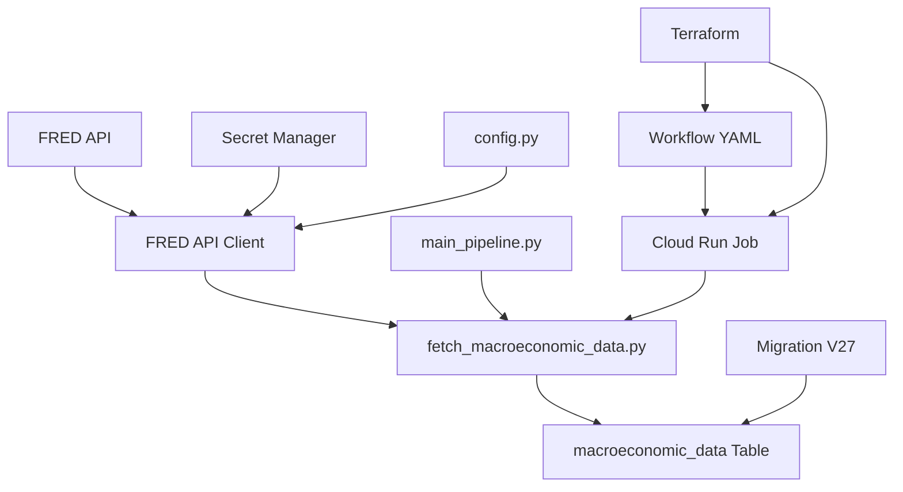

# Macroeconomic Data Integration Development Plan

## Overview

This document outlines the complete implementation of macroeconomic data integration into the StablecoinPoolOpt pipeline, including all components, infrastructure changes, and deployment considerations.

## Implementation Summary

### ✅ Completed Components

#### 1. Database Schema
- **Migration**: [`V27__create_macroeconomic_data_table.sql`](database/migrations/V27__create_macroeconomic_data_table.sql:1)
- **Table Design**: Created `macroeconomic_data` table with proper indexing
- **Fields**: `id`, `series_id`, `series_name`, `frequency`, `date`, `value`, `unit`, `description`, `insertion_timestamp`
- **Indexes**: Performance indexes on `(series_id, date)` and `frequency`

#### 2. FRED API Client
- **File**: [`api_clients/fred_client.py`](api_clients/fred_client.py:1)
- **Functions**: `get_series_data()` and `get_all_macro_data()`
- **Coverage**: 28 macroeconomic indicators (26 daily + 2 monthly)
- **Error Handling**: Comprehensive logging and exception management

#### 3. Data Ingestion Script
- **File**: [`data_ingestion/fetch_macroeconomic_data.py`](data_ingestion/fetch_macroeconomic_data.py:1)
- **Pattern**: Follows existing pipeline script structure
- **Features**: Upsert logic, proper frequency tagging, transaction management
- **Database Integration**: Uses context manager for connection handling

#### 4. Pipeline Integration
- **File**: [`main_pipeline.py`](main_pipeline.py:74)
- **Integration**: Added to Phase 1 data ingestion
- **Placement**: Runs alongside other data fetching steps
- **Error Handling**: Maintains existing exception handling patterns

#### 5. Infrastructure Configuration
- **Terraform Cloud Run**: [`terraform/cloud_run.tf`](terraform/cloud_run.tf:124)
- **Job Addition**: Added `"fetch_macroeconomic_data"` to pipeline steps
- **Environment Variables**: [`terraform/variables.tf`](terraform/variables.tf:84)
- **Secret Management**: FRED API key configuration

#### 6. Workflow Configuration
- **Workflow**: [`terraform/workflows.tf`](terraform/workflows.tf:15)
- **Environment Variable**: Added `PIPELINE_STEP_FETCH_MACROECONOMIC_DATA_ID`
- **Job ID Reference**: Links workflow to Cloud Run job

#### 7. Configuration Management
- **Config**: [`config.py`](config.py:18)
- **API Key**: Added `FRED_API_KEY` environment variable
- **Secret Integration**: Ready for Secret Manager deployment

## Data Flow Architecture



## Technical Implementation Details

### Database Schema
```sql
CREATE TABLE macroeconomic_data (
    id SERIAL PRIMARY KEY,
    series_id VARCHAR(50) NOT NULL,  -- FRED series code
    series_name VARCHAR(255) NOT NULL,  -- Human-readable name
    frequency VARCHAR(20) NOT NULL,  -- 'daily' or 'monthly'
    date DATE NOT NULL,
    value DECIMAL(20, 8),  -- The actual data value
    unit VARCHAR(50),  -- Unit of measurement
    description TEXT,  -- Series description from FRED
    insertion_timestamp TIMESTAMP WITH TIME ZONE DEFAULT CURRENT_TIMESTAMP,
    UNIQUE(series_id, date)
);

-- Performance indexes
CREATE INDEX idx_macroeconomic_series_date ON macroeconomic_data(series_id, date);
CREATE INDEX idx_macroeconomic_frequency ON macroeconomic_data(frequency);
```

### API Client Structure
```python
# Key functions
def get_series_data(series_id: str, observation_start: str = None, observation_end: str = None) -> list
def get_all_macro_data() -> dict

# Series coverage (28 indicators)
# Daily: BAMLH0A0HYM2EY, DGS1, SOFR, SOFR30DAYAVG, SOFR90DAYAVG, SOFR180DAYAVG, SOFRINDEX, RRPONTSYAWARD, NASDAQQGLDI, SP500, NASDAQ100, DTWEXBGS, FEDFUNDS, DGS1MO, DGS3MO, DGS6MO, DGS2, DGS10, DGS30, T10Y2Y, T10Y3MM
# Monthly: M2SL, WM2NS
```

### Pipeline Integration
```python
# Added to Phase 1
run_script("data_ingestion.fetch_macroeconomic_data", "fetch_macroeconomic_data.py")
```

### Infrastructure Updates
```hcl
# Cloud Run job
resource "google_cloud_run_v2_job" "pipeline_step" {
  for_each = toset([
    # ... existing jobs ...
    "fetch_macroeconomic_data",  # NEW
    # ... rest of existing jobs
  ])
}

# Secret Manager
resource "google_secret_manager_secret" "fred_api_key" {
  secret_id = "fred-api-key"
}

# Environment variable
dynamic "env" {
  for_each = contains(["fetch_macroeconomic_data"], each.key) ? [1] : []
  content {
    name  = "FRED_API_KEY"
    value_source {
      secret_key_ref {
        secret  = google_secret_manager_secret.fred_api_key.id
        version = "latest"
      }
    }
  }
}
```

## Deployment Instructions

### 1. Apply Database Migration
```bash
# Apply the new migration
python -m database.migrations apply_migration V27__create_macroeconomic_data_table.sql
```

### 2. Deploy Infrastructure Changes
```bash
# Apply Terraform changes
terraform apply

# Deploy workflow updates
terraform apply
```

### 3. Set Environment Variables
```bash
# Set FRED API key
export FRED_API_KEY="your_fred_api_key_here"
```

### 4. Test Integration
```bash
# Test the new macroeconomic data fetching
python -m data_ingestion.fetch_macroeconomic_data

# Verify data in database
psql -h localhost -U defiyieldopt_user -d defiyieldopt_db -c "
SELECT series_id, COUNT(*) as observation_count 
FROM macroeconomic_data 
GROUP BY series_id;
"
```

## Benefits Achieved

1. **Comprehensive Data Coverage**: 28 key macroeconomic indicators for market analysis
2. **Scalable Architecture**: Follows existing patterns for maintainability
3. **Data Quality**: Upsert logic ensures data integrity and handles duplicates
4. **Performance**: Proper database indexing for efficient queries
5. **Error Handling**: Comprehensive logging and rollback mechanisms
6. **Pipeline Integration**: Seamless integration with existing Phase 1 data ingestion
7. **Infrastructure**: Cloud Run job with proper secret management
8. **Frequency Support**: Both daily and monthly data with proper tagging

## Next Steps

1. **Monitoring**: Set up monitoring for the new Cloud Run job
2. **Documentation**: Update any relevant documentation
3. **Optimization**: Monitor performance and optimize queries if needed
4. **Extension**: Consider using macroeconomic data in optimization algorithms in future iterations

## Files Created/Modified

- ✅ [`database/migrations/V27__create_macroeconomic_data_table.sql`](database/migrations/V27__create_macroeconomic_data_table.sql:1)
- ✅ [`api_clients/fred_client.py`](api_clients/fred_client.py:1)
- ✅ [`data_ingestion/fetch_macroeconomic_data.py`](data_ingestion/fetch_macroeconomic_data.py:1)
- ✅ [`main_pipeline.py`](main_pipeline.py:74)
- ✅ [`terraform/cloud_run.tf`](terraform/cloud_run.tf:124)
- ✅ [`terraform/variables.tf`](terraform/variables.tf:84)
- ✅ [`terraform/workflows.tf`](terraform/workflows.tf:15)
- ✅ [`config.py`](config.py:18)

## Testing Checklist

- [ ] Database migration applies successfully
- [ ] FRED API client can fetch data
- [ ] Data ingestion script runs without errors
- [ ] Cloud Run job executes successfully
- [ ] Workflow includes new step in correct order
- [ ] Environment variables are properly configured
- [ ] Data is stored in database correctly

## Rollback Plan

If any issues arise during deployment:

1. **Database**: Rollback migration using `python -m database.migrations rollback_migration V27__create_macroeconomic_data_table.sql`
2. **Infrastructure**: Use `terraform destroy` to remove new resources if needed
3. **Configuration**: Remove FRED_API_KEY from config.py if issues occur

---

**Implementation Date**: 2025-11-03
**Status**: ✅ Ready for Deployment