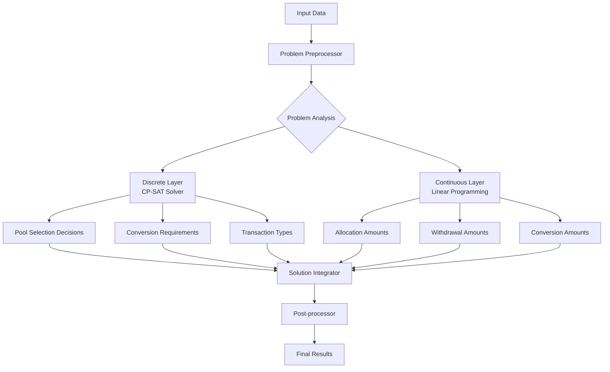

# OR-Tools Hybrid Model Implementation Plan

## Executive Summary

This document provides a detailed development task plan for implementing a hybrid CP-SAT + Linear Programming model to replace the current CVXPY/GUROBI implementation in the asset allocation optimization system. The transition addresses critical performance issues with large-scale problems (100+ pools, 10+ tokens) where current solve times are variable and often timeout.

## Problem Analysis

### Current Performance Issues
- **Scale Problems**: 100+ pools with 10+ tokens creates complex MILP with thousands of binary variables
- **Inconsistent Performance**: Variable solve times with frequent timeouts
- **Memory Usage**: Large constraint matrices causing memory pressure
- **Solver Limitations**: GUROBI may not be optimally configured for this specific problem structure

### Root Cause Analysis
1. **Binary Variable Proliferation**: Each (pool, token) pair requires multiple binary variables
2. **Big-M Constraints**: Inefficient handling of logical constraints
3. **Solver Communication Overhead**: CVXPY layer adds abstraction cost
4. **Memory Usage**: Large constraint matrices for complex problems

## Hybrid Model Architecture

### Design Philosophy
The hybrid approach separates discrete decisions (handled by CP-SAT) from continuous optimization (handled by Linear Programming) to maximize performance:



## Detailed Implementation Tasks

### Phase 1: Foundation and Infrastructure (Week 1)

#### ~~Task 1.0: Create Shared Data Loading Module~~ ✅ **COMPLETED**
**File**: `asset_allocation/data_loader.py`
**Estimated Time**: 0.5 day
**Dependencies**: None
**Completed**: 2025-10-21

**Subtasks**:
- Copy existing data loading functions from `optimize_allocations.py`
- Create standalone data loading module
- Ensure all database queries and data processing logic is preserved
- Add proper imports and error handling

**Functions to Copy**:
- `fetch_pool_data()` - Load approved pools with forecasted APY and TVL
- `fetch_token_prices()` - Load latest token prices from CoinMarketCap
- `fetch_gas_fee_data()` - Load forecasted gas fees and ETH price
- `fetch_current_balances()` - Load warm wallet balances and current allocations
- `fetch_allocation_parameters()` - Load allocation configuration parameters
- `parse_pool_tokens()` - Extract tokens from pool symbols
- `calculate_aum()` - Calculate total Assets Under Management
- `build_token_universe()` - Build complete token set for optimization

**Implementation Details**:
```python
# data_loader.py - Shared data loading functions
from database.db_utils import get_db_connection
import pandas as pd
import numpy as np
from typing import Dict, List, Tuple

def fetch_pool_data(engine) -> pd.DataFrame:
    # Copy existing implementation from optimize_allocations.py
    pass

def fetch_token_prices(engine, tokens: List[str]) -> Dict[str, float]:
    # Copy existing implementation from optimize_allocations.py
    pass

# ... other functions
```

#### Task 1.1: Create OR-Tools Infrastructure
**File**: `asset_allocation/or_tools_optimizer.py`
**Estimated Time**: 1 day
**Dependencies**: None

**Subtasks**:
- Create base `ORToolsOptimizer` class structure
- Implement data loading and preprocessing methods
- Set up logging and error handling
- Create configuration management for solver parameters

**Implementation Details**:
```python
from data_loader import (
    fetch_pool_data, fetch_token_prices, fetch_gas_fee_data,
    fetch_current_balances, fetch_allocation_parameters,
    parse_pool_tokens, calculate_aum, build_token_universe
)

class ORToolsOptimizer:
    def __init__(self):
        # Initialize data structures
        self.setup_data_structures()
        self.configure_solver()
    
    def load_data(self):
        """Load all required data using shared data loading functions"""
        engine = get_db_connection()
        
        # Load all data using existing functions
        self.pools_df = fetch_pool_data(engine)
        self.warm_wallet, self.current_allocations = fetch_current_balances(engine)
        self.tokens = build_token_universe(self.pools_df, self.warm_wallet, self.current_allocations)
        self.token_prices = fetch_token_prices(engine, self.tokens + ['ETH'])
        gas_gwei, eth_price = fetch_gas_fee_data(engine)
        self.gas_fee_usd = gas_gwei * 1e-9 * eth_price
        self.alloc_params = fetch_allocation_parameters(engine)
        
        # Calculate AUM
        self.total_aum = calculate_aum(self.warm_wallet, self.current_allocations, self.token_prices)
    
    def setup_data_structures(self):
        # Build indices and mappings
        pass
    
    def configure_solver(self):
        # Configure CP-SAT and LP solvers
        pass
```

#### Task 1.2: Implement Data Preprocessing
**File**: `asset_allocation/or_tools_optimizer.py`
**Estimated Time**: 1 day
**Dependencies**: Task 1.1

**Subtasks**:
- Create token and pool indexing system
- Implement problem size analysis and categorization
- Build constraint matrix sparsity analysis
- Create data validation methods

#### Task 1.3: Create Performance Monitoring Framework
**File**: `asset_allocation/performance_monitor.py`
**Estimated Time**: 1 day
**Dependencies**: None

**Subtasks**:
- Implement solve time tracking
- Create memory usage monitoring
- Build constraint generation metrics
- Set up performance logging

### Phase 2: Discrete Layer - CP-SAT Implementation (Week 2)

#### Task 2.1: Implement CP-SAT Variable Structure
**File**: `asset_allocation/discrete_layer.py`
**Estimated Time**: 2 days
**Dependencies**: Task 1.1

**Subtasks**:
- Create binary variables for pool selection
- Implement conversion requirement variables
- Build transaction type decision variables
- Create variable indexing and mapping

**Implementation Details**:
```python
class DiscreteLayer:
    def __init__(self, solver, n_pools, n_tokens):
        self.solver = solver
        self.n_pools = n_pools
        self.n_tokens = n_tokens
        self.create_variables()
    
    def create_variables(self):
        # Pool selection: pool_active[i] = 1 if pool i is used
        self.pool_active = [self.solver.BoolVar(f'pool_active_{i}') for i in range(self.n_pools)]
        
        # Conversion needs: needs_conversion[i,j] = 1 if token j needs conversion for pool i
        self.needs_conversion = [[self.solver.BoolVar(f'needs_conv_{i}_{j}') 
                                 for j in range(self.n_tokens)] for i in range(self.n_pools)]
        
        # Transaction types: has_withdrawal[i,j], has_allocation[i,j], has_conversion[i,j]
        self.has_withdrawal = [[self.solver.BoolVar(f'has_withdrawal_{i}_{j}') 
                               for j in range(self.n_tokens)] for i in range(self.n_pools)]
        self.has_allocation = [[self.solver.BoolVar(f'has_allocation_{i}_{j}') 
                               for j in range(self.n_tokens)] for i in range(self.n_pools)]
```

#### Task 2.2: Implement CP-SAT Constraints
**File**: `asset_allocation/discrete_layer.py`
**Estimated Time**: 2 days
**Dependencies**: Task 2.1

**Subtasks**:
- Create pool selection constraints
- Implement conversion logic constraints
- Build transaction sequencing constraints
- Add multi-token pool even distribution constraints

**Key Constraints**:
```python
def add_pool_selection_constraints(self):
    # Maximum number of active pools
    self.solver.Add(sum(self.pool_active) <= self.max_active_pools)
    
    # Pool activation logic
    for i in range(self.n_pools):
        for j in range(self.n_tokens):
            # If allocation exists, pool must be active
            self.solver.AddImplication(self.has_allocation[i][j], self.pool_active[i])

def add_conversion_logic_constraints(self):
    for i in range(self.n_pools):
        for j in range(self.n_tokens):
            # Conversion needed if allocation exceeds available balance
            self.solver.AddImplication(
                self.needs_conversion[i][j], 
                self.has_allocation[i][j]
            )
```

#### Task 2.3: Implement CP-SAT Objective
**File**: `asset_allocation/discrete_layer.py`
**Estimated Time**: 1 day
**Dependencies**: Task 2.2

**Subtasks**:
- Create preliminary objective for discrete decisions
- Implement cost minimization for transaction types
- Add penalty terms for complexity

### Phase 3: Continuous Layer - Linear Programming (Week 3)

#### Task 3.1: Implement LP Variable Structure
**File**: `asset_allocation/continuous_layer.py`
**Estimated Time**: 2 days
**Dependencies**: Task 2.1

**Subtasks**:
- Create continuous variables for allocations
- Implement withdrawal amount variables
- Build conversion amount variables
- Create warm wallet balance variables

**Implementation Details**:
```python
class ContinuousLayer:
    def __init__(self, solver, n_pools, n_tokens, discrete_layer):
        self.solver = solver
        self.n_pools = n_pools
        self.n_tokens = n_tokens
        self.discrete_layer = discrete_layer
        self.create_variables()
    
    def create_variables(self):
        # Allocation amounts
        self.alloc = [[self.solver.NumVar(0, self.infinity, f'alloc_{i}_{j}') 
                      for j in range(self.n_tokens)] for i in range(self.n_pools)]
        
        # Withdrawal amounts
        self.withdraw = [[self.solver.NumVar(0, self.infinity, f'withdraw_{i}_{j}') 
                         for j in range(self.n_tokens)] for i in range(self.n_pools)]
        
        # Conversion amounts
        self.convert = [[self.solver.NumVar(0, self.infinity, f'convert_{i}_{j}') 
                        for j in range(self.n_tokens)] for i in range(self.n_tokens)]
```

#### Task 3.2: Implement LP Constraints
**File**: `asset_allocation/continuous_layer.py`
**Estimated Time**: 2 days
**Dependencies**: Task 3.1, Task 2.2

**Subtasks**:
- Create balance conservation constraints
- Implement allocation limit constraints
- Build withdrawal limit constraints
- Add TVL limit constraints

#### Task 3.3: Link Discrete and Continuous Layers
**File**: `asset_allocation/solution_integrator.py`
**Estimated Time**: 1 day
**Dependencies**: Task 3.2, Task 2.3

**Subtasks**:
- Create linking constraints between layers
- Implement Big-M constraints with optimized bounds
- Build consistency checks
- Add solution validation methods

### Phase 4: Solution Integration and Optimization (Week 4)

#### Task 4.1: Implement Solution Integrator
**File**: `asset_allocation/solution_integrator.py`
**Estimated Time**: 2 days
**Dependencies**: Task 3.3

**Subtasks**:
- Create two-phase solving process
- Implement solution transfer between layers
- Build iterative refinement mechanism
- Add convergence criteria

**Algorithm Flow**:
```python
class SolutionIntegrator:
    def solve_hybrid(self):
        # Phase 1: Solve discrete layer
        discrete_solution = self.solve_discrete_layer()
        
        # Phase 2: Fix discrete decisions, solve continuous layer
        continuous_solution = self.solve_continuous_layer(discrete_solution)
        
        # Phase 3: Iterative refinement if needed
        return self.refine_solution(discrete_solution, continuous_solution)
    
    def solve_discrete_layer(self):
        # Solve CP-SAT for discrete decisions
        status = self.discrete_solver.Solve()
        return self.extract_discrete_solution()
    
    def solve_continuous_layer(self, discrete_solution):
        # Fix discrete variables, solve LP
        self.apply_discrete_decisions(discrete_solution)
        status = self.continuous_solver.Solve()
        return self.extract_continuous_solution()
```

#### Task 4.2: Implement Performance Optimizations
**File**: `asset_allocation/performance_optimizations.py`
**Estimated Time**: 2 days
**Dependencies**: Task 4.1

**Subtasks**:
- Implement variable ordering strategies
- Create constraint priority system
- Build domain reduction techniques
- Add symmetry breaking constraints

#### Task 4.3: Implement Parallel Processing
**File**: `asset_allocation/parallel_solver.py`
**Estimated Time**: 1 day
**Dependencies**: Task 4.2

**Subtasks**:
- Create multi-threaded constraint generation
- Implement parallel solution strategies
- Build concurrent evaluation framework
- Add load balancing mechanisms

### Phase 5: Testing and Validation (Week 5)

#### Task 5.1: Create Comprehensive Test Suite
**File**: `tests/test_or_tools_optimizer.py`
**Estimated Time**: 2 days
**Dependencies**: Task 4.3

**Subtasks**:
- Implement unit tests for all components
- Create integration tests for end-to-end flow
- Build performance regression tests
- Add solution validation tests

#### Task 5.2: Implement Benchmarking Framework
**File**: `tests/benchmark_framework.py`
**Estimated Time**: 2 days
**Dependencies**: Task 5.1

**Subtasks**:
- Create comparison tests with CVXPY solutions
- Build scalability test suite
- Implement memory usage benchmarks
- Add solve time distribution analysis

#### Task 5.3: Create Solution Validation
**File**: `tests/solution_validator.py`
**Estimated Time**: 1 day
**Dependencies**: Task 5.2

**Subtasks**:
- Implement constraint satisfaction validation
- Create objective function verification
- Build solution quality metrics
- Add edge case testing

### Phase 6: Migration and Integration (Week 6)

#### Task 6.1: Create Migration Interface
**File**: `asset_allocation/migration_interface.py`
**Estimated Time**: 1 day
**Dependencies**: Task 5.3

**Subtasks**:
- Create adapter pattern for solver switching
- Implement configuration-based solver selection
- Build fallback mechanisms
- Add performance monitoring

#### Task 6.2: Implement A/B Testing Framework
**File**: `asset_allocation/ab_testing.py`
**Estimated Time**: 2 days
**Dependencies**: Task 6.1

**Subtasks**:
- Create parallel execution framework
- Implement result comparison logic
- Build statistical significance testing
- Add automated decision making

#### Task 6.3: Create Deployment Pipeline
**File**: `asset_allocation/deployment.py`
**Estimated Time**: 2 days
**Dependencies**: Task 6.2

**Subtasks**:
- Implement gradual rollout mechanism
- Create monitoring and alerting
- Build rollback procedures
- Add performance dashboards

## Key Implementation Details

### Variable Reduction Strategies
1. **Pool Selection**: Use hierarchical selection (protocol → pool → token)
2. **Conversion Logic**: Pre-compute conversion requirements
3. **Transaction Types**: Consolidate similar transaction patterns

### Constraint Optimization
1. **Sparsity**: Structure constraints for efficient matrix operations
2. **Bound Tightening**: Compute tight variable bounds
3. **Decomposition**: Separate independent constraint blocks

### Performance Monitoring
1. **Real-time Metrics**: Track solve time, memory usage, iteration count
2. **Quality Metrics**: Monitor objective value, constraint violations
3. **Regression Detection**: Alert on performance degradation

## File Structure

```
asset_allocation/
├── data_loader.py                     # Shared data loading functions (copied from CVXPY)
├── or_tools_optimizer.py              # Main OR-Tools optimizer class
├── discrete_layer.py                  # CP-SAT discrete decision layer
├── continuous_layer.py                # Linear programming continuous layer
├── solution_integrator.py             # Hybrid solution integration
├── performance_optimizations.py       # Performance optimization techniques
├── parallel_solver.py                 # Parallel processing implementation
├── performance_monitor.py             # Performance monitoring framework
├── migration_interface.py             # Migration and compatibility layer
├── ab_testing.py                      # A/B testing framework
└── deployment.py                      # Deployment and monitoring

tests/
├── test_or_tools_optimizer.py         # Comprehensive test suite
├── benchmark_framework.py             # Performance benchmarking
└── solution_validator.py              # Solution validation utilities
```

## Success Criteria

### Performance Targets
- **Solve Time**: 95% of problems solve within 30 seconds
- **Timeout Rate**: < 5% timeout rate
- **Memory Usage**: 50% reduction vs CVXPY
- **Solution Quality**: Equivalent or better objective values

### Quality Assurance
- All constraints satisfied in 100% of test cases
- Solution quality within 0.1% of CVXPY solutions
- No regression in existing functionality
- Comprehensive test coverage (>90%)

## Risk Assessment and Mitigation

### Technical Risks
1. **Solution Quality Differences**: Mitigated by comprehensive validation
2. **Implementation Complexity**: Addressed by phased approach
3. **Performance Regression**: Prevented by parallel testing
4. **Integration Issues**: Resolved by careful API design

### Business Risks
1. **Deployment Delays**: Managed through parallel implementation
2. **Performance Expectations**: Set realistic targets based on testing
3. **Resource Requirements**: Planned capacity and monitoring

## Timeline and Resources

### 6-Week Implementation Plan
- **Week 1**: Foundation setup and data loading (Tasks 1.0-1.3)
- **Week 2**: Discrete layer implementation (Tasks 2.1-2.3)
- **Week 3**: Continuous layer implementation (Tasks 3.1-3.3)
- **Week 4**: Solution integration and optimization (Tasks 4.1-4.3)
- **Week 5**: Testing and validation (Tasks 5.1-5.3)
- **Week 6**: Migration and deployment (Tasks 6.1-6.3)

### Resource Requirements
- 1 senior developer (full-time)
- 1 performance engineer (part-time, weeks 3-5)
- 1 QA engineer (part-time, weeks 5-6)
- Development and testing environments

## Migration Strategy

### Phase 1: Parallel Implementation
- Run both CVXPY and OR-Tools simultaneously
- Compare results and performance metrics
- Validate solution quality equivalence

### Phase 2: A/B Testing
- Route percentage of problems to OR-Tools
- Monitor performance and solution quality
- Gradually increase OR-Tools usage

### Phase 3: Gradual Rollout
- Start with non-critical optimization runs
- Monitor system stability and performance
- Full migration once confidence is established

### Phase 4: Deprecation
- Maintain CVXPY as fallback for limited time
- Monitor for any performance regressions
- Complete deprecation once stable

## Monitoring and Alerting

### Key Metrics
1. **Performance Metrics**: Solve time, memory usage, iteration count
2. **Quality Metrics**: Objective value, constraint violations
3. **Business Metrics**: Daily yield improvement, transaction costs

### Alerting Thresholds
- Solve time > 60 seconds
- Memory usage > 2GB
- Solution quality deviation > 0.5%
- Constraint violations > 0.01%

## Conclusion

This implementation plan provides a structured approach to transitioning from CVXPY/GUROBI to OR-Tools using a hybrid CP-SAT + Linear Programming model. The phased approach minimizes risk while delivering significant performance improvements for large-scale asset allocation problems.

The key innovation is the separation of discrete and continuous optimization, allowing each layer to use the most appropriate solver for its specific problem characteristics. This approach should provide the performance improvements needed for large-scale problems while maintaining solution quality and system reliability.