# Repository Pattern Migration Plan

## Overview

This document outlines the comprehensive migration plan for transitioning the StablecoinPoolOpt pipeline from embedded SQL queries to the repository pattern. The migration will completely replace direct SQL usage with a clean, maintainable data access layer while preserving all existing business logic and performance characteristics.

## Current State Analysis

The current codebase has:
- SQL queries embedded directly in business logic across all pipeline phases
- Direct database connections using SQLAlchemy's `text()` wrapper
- Complex queries mixed with data transformation logic
- No separation between data access and business logic
- Repeated connection management patterns
- Heavy use of bulk operations for performance (psycopg2 execute_values)
- Complex unique constraint handling with ON CONFLICT clauses
- Manual transaction management with explicit begin/commit/rollback

## Target Architecture

```mermaid
graph TB
    subgraph "Repository Layer"
        BaseRepo[BaseRepository]
        PoolRepo[PoolRepository]
        TxnRepo[TransactionRepository]
        AllocRepo[AllocationRepository]
        MetricsRepo[PoolMetricsRepository]
        TokenRepo[TokenRepository]
        ParamRepo[ParameterRepository]
        MacroRepo[MacroeconomicRepository]
        GasRepo[GasFeeRepository]
        RawRepo[RawDataRepository]
        BalanceRepo[DailyBalanceRepository]
    end
    
    subgraph "ORM Models"
        Pool[Pool Model]
        Txn[Transaction Model]
        Alloc[Allocation Model]
        Metrics[PoolMetrics Model]
        Token[Token Model]
        Param[Parameter Model]
        Macro[Macroeconomic Model]
        Gas[GasFee Model]
        Raw[RawData Model]
        Balance[DailyBalance Model]
    end
    
    subgraph "Business Logic Layer"
        DataIngestion[Data Ingestion Scripts]
        DataProcessing[Data Processing Scripts]
        AssetAllocation[Asset Allocation Scripts]
        Forecasting[Forecasting Scripts]
        Reporting[Reporting Scripts]
    end
    
    BaseRepo --> PoolRepo
    BaseRepo --> TxnRepo
    BaseRepo --> AllocRepo
    BaseRepo --> MetricsRepo
    BaseRepo --> TokenRepo
    BaseRepo --> ParamRepo
    BaseRepo --> MacroRepo
    BaseRepo --> GasRepo
    BaseRepo --> RawRepo
    BaseRepo --> BalanceRepo
    
    PoolRepo --> Pool
    TxnRepo --> Txn
    AllocRepo --> Alloc
    MetricsRepo --> Metrics
    TokenRepo --> Token
    ParamRepo --> Param
    MacroRepo --> Macro
    GasRepo --> Gas
    RawRepo --> Raw
    BalanceRepo --> Balance
    
    DataIngestion --> PoolRepo
    DataIngestion --> TxnRepo
    DataIngestion --> TokenRepo
    DataIngestion --> ParamRepo
    DataIngestion --> MacroRepo
    DataIngestion --> GasRepo
    DataIngestion --> RawRepo
    
    DataProcessing --> PoolRepo
    DataProcessing --> MetricsRepo
    DataProcessing --> ParamRepo
    
    AssetAllocation --> AllocRepo
    AssetAllocation --> PoolRepo
    AssetAllocation --> TokenRepo
    AssetAllocation --> ParamRepo
    AssetAllocation --> BalanceRepo
    
    Forecasting --> MetricsRepo
    Forecasting --> PoolRepo
    Forecasting --> GasRepo
    
    Reporting --> AllocRepo
    Reporting --> TxnRepo
    Reporting --> MetricsRepo
    Reporting --> BalanceRepo
```



## Domain Entity Identification

Based on the complete database schema analysis (migrations V1-V29) and pipeline script analysis, these core domain entities are identified:

1. **Pool Entity** - DeFi pool information and metadata
2. **PoolMetrics Entity** - Daily pool metrics and forecasts
3. **AccountTransaction Entity** - Blockchain transactions and operations
4. **DailyBalance Entity** - Daily balance tracking
5. **AssetAllocation Entity** - Asset allocation records
6. **AllocationParameters Entity** - Configuration parameters
7. **Token Entity** - Approved/blacklisted tokens
8. **Protocol Entity** - Approved protocols
9. **MacroeconomicData Entity** - Economic indicators
10. **GasFees Entity** - Gas fee tracking
11. **RawData Entities** - Raw API responses (DeFiLlama, CoinMarketCap, etc.)

## Implementation Strategy

### Phase 1: Foundation Setup (Completed)
1. Create `database/models/` directory for SQLAlchemy declarative models
2. Create `database/repositories/` directory for repository classes
3. Implement `BaseRepository` with:
   - Connection management using existing `get_db_connection()`
   - Automated context manager support for transaction handling
   - Common CRUD patterns (create, read, update, delete)
   - Bulk operation support using psycopg2 execute_values
   - Unique constraint handling with graceful conflict resolution
   - Standardized error handling and logging
   - Performance-optimized bulk operations

### Phase 2: ORM Models Creation (Completed)
Create declarative models matching existing schema:
- Use SQLAlchemy's declarative base for explicit control
- Map all tables from migrations V1-V29
- Define relationships between entities
- Include proper data types and constraints
- Maintain existing column names and structures
- Handle JSONB columns appropriately
- Map array types (TEXT[]) correctly
- Preserve all unique constraints and indexes

### Phase 3: Repository Implementation (Completed)
Create domain-specific repositories extending BaseRepository:

#### BaseRepository Design
- **Context Manager Support**: Automated transaction handling with rollback on errors
- **Bulk Operations**: Use psycopg2 execute_values for performance-critical operations
- **Connection Management**: Leverage existing get_db_connection() with caching
- **Unique Constraint Handling**: Graceful conflict resolution following business logic patterns
- **Logging Integration**: Standardized logging consistent with existing patterns
- **Error Handling**: Custom repository exceptions with detailed error context

#### PoolRepository
- Pool CRUD operations with bulk upsert capabilities
- Active/inactive pool management with bulk updates
- Pool filtering and searching with complex query support
- Pool metadata updates with conflict resolution
- Integration with token and protocol data
- Bulk stale pool detection and marking

#### PoolMetricsRepository
- Daily metrics CRUD with bulk insert/update operations
- Historical metrics queries with date range optimization
- Forecast data management with conflict handling
- Performance analytics queries with rolling calculations
- Rolling calculations support with efficient window functions
- Bulk metrics population for historical data

#### TransactionRepository
- Transaction CRUD operations with bulk insert support
- Balance calculations with CTE optimization
- Transaction filtering and searching with indexed queries
- Complex CTE queries for ledger management
- Address-based transaction queries with performance optimization
- Bulk transaction processing with duplicate handling

#### DailyBalanceRepository
- Daily balance tracking with bulk upsert operations
- AUM calculations with efficient aggregation queries
- Wallet balance management with conflict resolution
- Allocation balance queries with join optimization
- Bulk balance updates with transaction safety

#### AllocationRepository
- Asset allocation CRUD with bulk insert capabilities
- Optimization result storage with conflict handling
- Allocation sequence management with unique constraints
- Transaction cost tracking with efficient updates
- Bulk allocation operations with rollback support

#### ParameterRepository
- Configuration parameter CRUD with default value support
- Default parameter management with caching
- Parameter snapshots with JSON handling
- Dynamic limit queries with efficient lookups
- Bulk parameter updates with validation

#### TokenRepository
- Approved/blacklisted token management with bulk operations
- Token address mapping with efficient lookups
- Token validation queries with proper indexing
- Bulk token updates with conflict resolution

#### MacroeconomicRepository
- Economic data CRUD with bulk insert support
- Time series queries with date optimization
- FRED data integration with duplicate handling
- Bulk economic data processing

#### GasFeeRepository
- Gas fee tracking with bulk operations
- Forecast management with conflict resolution
- Historical gas data queries with performance optimization
- Bulk gas fee updates with efficient indexing

#### RawDataRepository
- Raw API data management with bulk insert capabilities
- Data deduplication with efficient conflict handling
- JSON data extraction with optimized queries
- Timestamp-based queries with proper indexing
- Bulk raw data processing with duplicate prevention

### Phase 4: Complete Script Migration

#### Data Ingestion Scripts
1. **fetch_defillama_pools.py**
    - Replace: Pool metadata bulk insertion, raw data storage
    - Use: PoolRepository.bulk_upsert_pools(), RawDataRepository.insert_raw_data()
    - Preserve: Existing psycopg2 execute_values performance pattern
    - Handle: Unique constraint conflicts gracefully with business logic replication

2. **fetch_defillama_pool_history.py**
    - Replace: Pool history data bulk insertion
    - Use: PoolRepository.bulk_upsert_history(), RawDataRepository.insert_raw_data()
    - Preserve: Bulk insert performance characteristics

3. **fetch_ohlcv_coinmarketcap.py**
    - Replace: OHLCV data bulk storage
    - Use: RawDataRepository.insert_ohlcv_data()
    - Preserve: Existing bulk insert patterns

4. **fetch_gas_ethgastracker.py**
    - Replace: Gas fee data bulk storage
    - Use: GasFeeRepository.bulk_upsert_gas_data(), RawDataRepository.insert_raw_data()
    - Preserve: Existing bulk operation performance

5. **fetch_account_transactions.py**
    - Replace: Transaction bulk processing and storage
    - Use: TransactionRepository.bulk_insert_transactions(), RawDataRepository.insert_raw_data()
    - Preserve: Complex transaction parsing logic and bulk operations

6. **fetch_macroeconomic_data.py**
    - Replace: Economic data bulk storage
    - Use: MacroeconomicRepository.bulk_upsert_economic_data()
    - Preserve: Existing bulk insert patterns

#### Data Processing Scripts
1. **filter_pools_pre.py**
    - Replace: Complex pool filtering logic, token validation
    - Use: PoolRepository.get_active_pools(), TokenRepository.get_approved_tokens(), 
           ParameterRepository.get_filtering_parameters()
    - Preserve: Complex filtering CTEs, address validation, bulk pool updates
    - Handle: Pendle protocol special logic, Ethplorer API integration

2. **calculate_pool_metrics.py**
    - Replace: Complex metrics calculations, historical data queries
    - Use: PoolMetricsRepository.bulk_upsert_metrics(), PoolRepository.get_pool_history()
    - Preserve: Rolling calculations, bulk insert performance, exogenous data merging
    - Handle: Complex historical data processing, missing data filling

3. **apply_pool_grouping.py**
    - Replace: Pool group bulk assignments
    - Use: PoolMetricsRepository.bulk_update_groups()
    - Preserve: Direct group table operations with bulk updates

4. **process_icebox_logic.py**
    - Replace: Icebox token processing
    - Use: PoolMetricsRepository.bulk_update_icebox_status(), ParameterRepository.get_icebox_parameters()
    - Preserve: Icebox-specific queries and bulk updates

#### Forecasting Scripts
1. **forecast_pools.py**
    - Replace: Global LightGBM forecast generation and storage
    - Use: PoolMetricsRepository.bulk_update_forecasts(), PoolMetricsRepository.get_training_data()
    - Preserve: ML model integration, bulk forecast updates

2. **forecast_gas_fees.py**
    - Replace: Gas fee forecasting with XGBoost
    - Use: GasFeeRepository.upsert_forecasts(), GasFeeRepository.get_historical_data()
    - Preserve: Complex ML preprocessing, bulk forecast operations

#### Asset Allocation Scripts
1. **optimize_allocations.py**
    - Replace: Complex optimization algorithm, balance queries
    - Use: AllocationRepository.get_current_allocations(), PoolRepository.get_filtered_pools(),
           BalanceRepository.get_wallet_balances(), ParameterRepository.get_optimization_parameters()
    - Preserve: Complex AUM calculations, allocation storage, CVXPY optimization
    - Handle: Multi-token pool support, rebalancing logic, gas fee optimization

2. **manage_ledger.py**
    - Replace: Daily balance management, transaction tracking
    - Use: DailyBalanceRepository.bulk_upsert_balances(), TransactionRepository.get_unmatched_transactions()
    - Preserve: Ledger CTEs, balance calculations, bulk operations
    - Handle: Complex receipt token tracking, minted token flows

#### Reporting Scripts
1. **post_slack_notification.py**
    - Replace: Allocation summary queries
    - Use: AllocationRepository.get_allocation_summary(), BalanceRepository.get_balance_summary()
    - Preserve: Direct summary queries, notification formatting

### Phase 5: Pipeline Integration
- Update imports in all scripts to use repositories
- Maintain existing function signatures for compatibility
- Remove direct SQL queries and connection management
- Ensure all pipeline phases continue to work
- Update error handling to use repository exceptions
- Maintain logging compatibility with existing patterns
- Preserve all existing business logic without modification

## Key Design Considerations

### 1. Bulk Operations Performance
- Maintain existing psycopg2 execute_values patterns for performance-critical operations
- Implement repository bulk methods that internally use execute_values
- Preserve batch processing characteristics (page_size, chunking)
- Keep existing bulk insert performance for large datasets
- Use efficient bulk upsert patterns for conflict resolution

### 2. Unique Constraint Handling
- Implement graceful conflict resolution in repositories
- Follow existing business logic patterns for conflict handling
- Use ON CONFLICT DO UPDATE/NOTHING patterns where appropriate
- Preserve existing data integrity constraints
- Handle unique constraint violations at repository layer

### 3. Business Logic Preservation
- Absolutely no changes to business logic or algorithms
- Maintain all existing filtering criteria and calculations
- Preserve complex optimization algorithms and ML models
- Keep all existing data transformations and validations
- No reorganization of functionality beyond data access layer

### 4. Transaction Management
- Implement automated context manager for transaction handling
- Preserve existing rollback behavior on errors
- Maintain transaction boundaries as currently defined
- Use existing connection pooling and management
- Keep current isolation levels and consistency guarantees

### 5. Logging Standardization
- Implement consistent logging patterns across all repositories
- Preserve existing log formats and levels
- Maintain current error reporting mechanisms
- Use existing logger instances and configurations
- Keep current debugging and monitoring capabilities

## Migration Benefits

1. **Separation of Concerns**: Clear distinction between data access and business logic
2. **Maintainability**: All database operations centralized in repositories
3. **Consistency**: Uniform error handling and transaction management
4. **Performance**: Preserved bulk operations and optimized queries
5. **Future-proof**: Easy to add new data access patterns
6. **Testability**: Repositories can be easily mocked for unit testing
7. **Reusability**: Common database operations centralized in base class
8. **Business Logic Integrity**: No changes to existing algorithms or calculations

## File Structure After Migration

```
database/
├── models/
│   ├── __init__.py
│   ├── base.py
│   ├── pool.py
│   ├── pool_metrics.py
│   ├── transaction.py
│   ├── daily_balance.py
│   ├── asset_allocation.py
│   ├── allocation_parameters.py
│   ├── token.py
│   ├── protocol.py
│   ├── macroeconomic_data.py
│   ├── gas_fees.py
│   └── raw_data.py
├── repositories/
│   ├── __init__.py
│   ├── base_repository.py
│   ├── pool_repository.py
│   ├── pool_metrics_repository.py
│   ├── transaction_repository.py
│   ├── daily_balance_repository.py
│   ├── allocation_repository.py
│   ├── parameter_repository.py
│   ├── token_repository.py
│   ├── macroeconomic_repository.py
│   ├── gas_fee_repository.py
│   └── raw_data_repository.py
└── migrations/ (existing)
```

## Implementation Notes

### BaseRepository Design
- Context manager support: `with repository as repo:` pattern
- Bulk operation methods using psycopg2 execute_values
- Transaction management with automatic rollback on errors
- Logging integration with existing logger patterns
- Error handling with custom repository exceptions
- Connection pooling using existing get_db_connection()
- Performance optimization for large datasets

### ORM Model Considerations
- Use exact column names from existing schema
- Handle JSONB columns with proper serialization
- Map array types (TEXT[]) correctly
- Maintain all constraints and indexes from migrations
- Include proper relationships between entities
- Preserve all unique constraints and foreign keys

### Script Refactoring Guidelines
- Preserve all existing functionality without modification
- Maintain function signatures for pipeline compatibility
- Replace only direct SQL with repository method calls
- Keep business logic in scripts, move data access to repositories
- Maintain existing error handling and logging patterns
- Preserve bulk operation performance characteristics
- Handle unique constraints following existing business logic

This comprehensive migration plan ensures a clean transition to the repository pattern while maintaining all existing pipeline functionality, performance characteristics, and business logic integrity.