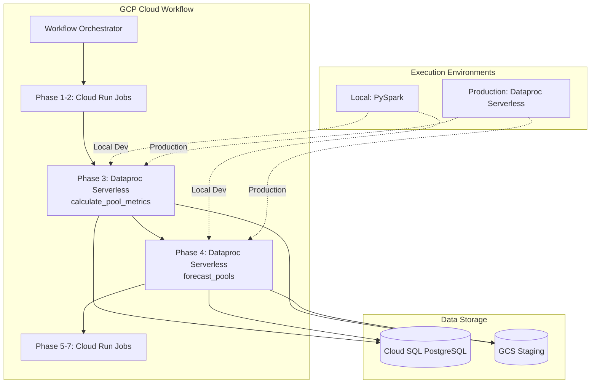
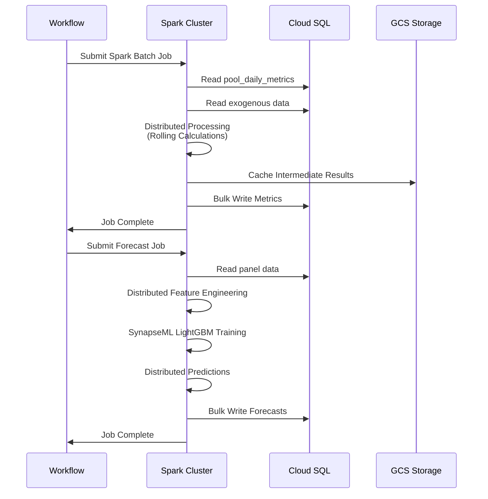

# SynapseML Spark Integration Plan for Pipeline Optimization

## Executive Summary

This document outlines the complete plan to integrate **SynapseML LightGBM** with **GCP Serverless Spark (Dataproc Serverless)** to optimize the most compute-intensive steps of our StablecoinPoolOpt pipeline: [`calculate_pool_metrics.py`](../data_processing/calculate_pool_metrics.py) and [`forecast_pools.py`](../forecasting/forecast_pools.py).

**Key Goals:**
- Replace pandas-based sequential processing with distributed Spark processing
- Use SynapseML's LightGBMRegressor to maintain exact forecasting approach
- Achieve 75-80% reduction in execution time (60-85 min → 15-20 min)
- Maintain local development compatibility
- Preserve sequential workflow dependencies
- Keep codebase clean without legacy fallbacks

## Table of Contents

1. [Background & Rationale](#background--rationale)
2. [Technology Stack](#technology-stack)
3. [Architecture Overview](#architecture-overview)
4. [Implementation Task List](#implementation-task-list)
5. [Code Transformation Examples](#code-transformation-examples)
6. [Local Development Setup](#local-development-setup)
7. [Expected Performance Improvements](#expected-performance-improvements)

---

## Background & Rationale

### Current Performance Bottlenecks

**calculate_pool_metrics.py** (30-45 minutes):
- Processes pools sequentially in Python loops (lines 191-252)
- Multiple database round-trips per pool
- Pandas operations on full datasets without parallelization
- Memory-intensive rolling window calculations

**forecast_pools.py** (30-40 minutes):
- Global LightGBM model training on large panel datasets
- Time-series cross-validation for TVL stacking (5-fold CV)
- Sequential feature engineering across pools
- Complex neighbor feature calculations

### Why SynapseML?

1. **Native LightGBM Support**: SynapseML provides distributed LightGBM that matches our current sklearn/LightGBM approach
2. **Proven Performance**: 10-30% faster than SparkML on similar datasets
3. **API Compatibility**: Similar API to sklearn, reducing migration complexity
4. **Distributed Training**: Automatically parallelizes model training across Spark cluster
5. **Production Ready**: Used by Microsoft in production workloads

---

## Technology Stack

### Core Technologies

| Component | Technology | Version | Purpose |
|-----------|-----------|---------|---------|
| Distributed Computing | Apache Spark | 3.4+ | Data processing framework |
| ML Library | SynapseML | 1.0.15+ | Distributed LightGBM |
| Execution Platform | GCP Dataproc Serverless | Latest | Managed Spark execution |
| Local Development | PySpark | 3.4+ | Local Spark development |
| Database | PostgreSQL | Current | Data persistence |
| Orchestration | GCP Workflows | Current | Pipeline sequencing |

### SynapseML Components

```python
from synapse.ml.lightgbm import LightGBMRegressor
from pyspark.ml.feature import VectorAssembler
from pyspark.sql import SparkSession
```

---

## Architecture Overview

### High-Level Architecture



### Data Flow



---

## Implementation Task List

### Infrastructure Setup

**Task 1: Enable GCP Services**
```bash
# Enable required APIs
gcloud services enable dataproc.googleapis.com
gcloud services enable storage-component.googleapis.com

# Create service account for Dataproc
gcloud iam service-accounts create dataproc-spark-sa \
    --display-name="Dataproc Serverless Service Account"

# Grant necessary permissions
gcloud projects add-iam-policy-binding $PROJECT_ID \
    --member="serviceAccount:dataproc-spark-sa@$PROJECT_ID.iam.gserviceaccount.com" \
    --role="roles/dataproc.worker"

gcloud projects add-iam-policy-binding $PROJECT_ID \
    --member="serviceAccount:dataproc-spark-sa@$PROJECT_ID.iam.gserviceaccount.com" \
    --role="roles/cloudsql.client"
```

**Task 2: Create GCS Buckets**
```bash
# Staging bucket for Spark jobs
gsutil mb -p $PROJECT_ID -l us-central1 \
    gs://${PROJECT_ID}-spark-staging

# Code and dependencies bucket
gsutil mb -p $PROJECT_ID -l us-central1 \
    gs://${PROJECT_ID}-spark-code

# Set lifecycle policies to auto-delete temp files
cat > lifecycle.json <<EOF
{
  "lifecycle": {
    "rule": [{
      "action": {"type": "Delete"},
      "condition": {"age": 7}
    }]
  }
}
EOF

gsutil lifecycle set lifecycle.json gs://${PROJECT_ID}-spark-staging
```

**Task 3: Create Terraform Configuration for Dataproc Serverless**

Create `terraform/dataproc_serverless.tf` with batch job definitions for:
- calculate_pool_metrics batch
- forecast_pools batch

Include runtime configurations for SynapseML packages.

**Task 4: Deploy Infrastructure**
```bash
cd terraform
terraform init
terraform plan
terraform apply
```

### Code Development

**Task 5: Set Up Local PySpark Development Environment**

Install and configure local Spark environment:
```bash
# Install PySpark and SynapseML
pip install pyspark==3.4.0 synapseml==1.0.15 pyarrow==14.0.0

# Set environment variables for local development
export SPARK_ENVIRONMENT=local
export DB_HOST=localhost
export DB_NAME=defiyieldopt_db
export DB_USER=your_user
export DB_PASSWORD=your_password
```

**Task 6: Create Spark Database Utilities**

Create `database/db_utils_spark.py` with functions:
- `create_jdbc_url()` - Build PostgreSQL JDBC connection string
- `read_table_spark()` - Read table into Spark DataFrame
- `write_table_spark()` - Write Spark DataFrame to PostgreSQL
- `execute_query_spark()` - Execute SQL query and return Spark DataFrame

**Task 7: Migrate calculate_pool_metrics to Spark**

Rewrite `data_processing/calculate_pool_metrics.py` as Spark implementation:
- Replace pandas DataFrame loading with Spark JDBC reads
- Convert sequential pool processing to Spark window functions
- Replace pandas rolling() with Spark window operations for:
  - `rolling_apy_7d`, `rolling_apy_30d`
  - `stddev_apy_7d`, `stddev_apy_30d`
  - `apy_delta_today_yesterday`
- Replace row-by-row database inserts with bulk Spark JDBC writes
- Add command-line argument parsing for database credentials

**Task 8: Migrate forecast_pools to SynapseML**

Rewrite `forecasting/forecast_pools.py` as Spark implementation:
- Import SynapseML LightGBMRegressor
- Replace pandas panel data loading with Spark JDBC
- Convert feature engineering to Spark operations:
  - Lag features using window functions
  - Calendar features using Spark date functions
- Replace sklearn LightGBM with SynapseML LightGBMRegressor
- Implement TVL stacking with Spark time-series CV
- Use VectorAssembler for feature preparation
- Generate predictions and write to database via Spark JDBC

**Task 9: Create Spark-Compatible Configuration**

Create `config_spark.py` with:
- Database connection parameters from environment variables
- Spark-specific configuration settings
- SynapseML package specifications

### Workflow Integration

**Task 10: Update workflow.yaml**

Modify `workflow.yaml` to:
- Add Dataproc batch job execution steps
- Replace Cloud Run calls for calculate_pool_metrics with Dataproc batch
- Replace Cloud Run calls for forecast_pools with Dataproc batch
- Maintain sequential execution dependencies
- Add proper error handling for batch jobs

**Task 11: Update terraform/workflows.tf**

Add environment variables for:
- Dataproc batch IDs
- GCS code bucket paths
- Database connection parameters

### Local Development & Main Pipeline

**Task 12: Add Environment Detection to Scripts**

Add environment detection logic at the top of both migrated scripts:
```python
def get_spark_session():
    if os.getenv('SPARK_ENVIRONMENT') == 'local':
        # Local PySpark with limited resources
        spark = SparkSession.builder \
            .master("local[*]") \
            .config("spark.driver.memory", "4g") \
            .getOrCreate()
    else:
        # Production - Dataproc manages config
        spark = SparkSession.builder.getOrCreate()
    return spark
```

**Task 13: Update main_pipeline.py**

Modify `run_script()` function to:
- Detect if script is Spark-based
- Set `SPARK_ENVIRONMENT=local` when `USE_LOCAL_SPARK=true`
- Pass database credentials as environment variables
- Call Spark scripts with proper arguments

**Task 14: Create Local Execution Scripts**

Create convenience scripts:
- `scripts/run_local_spark_metrics.sh` - Run metrics calculation locally
- `scripts/run_local_spark_forecast.sh` - Run forecasting locally

### Deployment

**Task 15: Upload Code to GCS**

Create deployment script:
```bash
# Upload main scripts
gsutil cp data_processing/calculate_pool_metrics.py \
    gs://${PROJECT_ID}-spark-code/

gsutil cp forecasting/forecast_pools.py \
    gs://${PROJECT_ID}-spark-code/

# Upload supporting modules
gsutil -m cp -r database/*.py \
    gs://${PROJECT_ID}-spark-code/database/

gsutil -m cp -r forecasting/*.py \
    gs://${PROJECT_ID}-spark-code/forecasting/
```

**Task 16: Deploy Workflow Updates**
```bash
cd terraform
terraform plan
terraform apply
```

**Task 17: Execute First Production Run**

Trigger workflow manually and monitor:
```bash
gcloud workflows execute stablecoin-pool-opt-pipeline \
    --location=us-central1
```

Monitor batch execution:
```bash
# Watch metrics batch
gcloud dataproc batches describe calculate-pool-metrics-<exec-id> \
    --location=us-central1

# Watch forecast batch
gcloud dataproc batches describe forecast-pools-<exec-id> \
    --location=us-central1
```

**Task 18: Validate Output Data**

Run validation queries:
```sql
-- Check metrics were written
SELECT COUNT(*), MIN(date), MAX(date) 
FROM pool_daily_metrics 
WHERE date >= CURRENT_DATE;

-- Compare row counts with previous runs
SELECT date, COUNT(*) as pool_count
FROM pool_daily_metrics
GROUP BY date
ORDER BY date DESC
LIMIT 10;

-- Verify forecast values are reasonable
SELECT pool_id, date, forecasted_apy, actual_apy
FROM pool_daily_metrics
WHERE date = CURRENT_DATE
LIMIT 100;
```

**Task 19: Monitor Performance Metrics**

Track execution times:
- Dataproc batch duration
- Database write performance
- Memory and CPU utilization
- Spark job stages and tasks

**Task 20: Clean Up**

Remove any temporary or backup files created during migration.
Update all documentation to reflect the Spark-based implementation.

---

## Code Transformation Examples

### Example 1: Rolling Calculations with Spark

**Current (Pandas):**
```python
# Sequential processing per pool
for pool_id in unique_pool_ids:
    pool_df = df_history[df_history['pool_id'] == pool_id]
    pool_df['rolling_apy_7d'] = pool_df['apy'].rolling(window=7).mean()
    pool_df['stddev_apy_7d'] = pool_df['apy'].rolling(window=7).std()
```

**New (Spark):**
```python
from pyspark.sql import Window
from pyspark.sql import functions as F

# Parallel processing across all pools
window_7d = Window.partitionBy("pool_id").orderBy("date").rowsBetween(-6, 0)

metrics_df = pool_df \
    .withColumn("rolling_apy_7d", F.avg("apy").over(window_7d)) \
    .withColumn("stddev_apy_7d", F.stddev("apy").over(window_7d))
```

### Example 2: LightGBM Training with SynapseML

**Current (sklearn):**
```python
from lightgbm import LGBMRegressor

model = LGBMRegressor(
    objective='regression',
    num_leaves=64,
    n_estimators=800,
    learning_rate=0.03
)
model.fit(X_train, y_train)
predictions = model.predict(X_test)
```

**New (SynapseML):**
```python
from synapse.ml.lightgbm import LightGBMRegressor
from pyspark.ml.feature import VectorAssembler

# Assemble features
assembler = VectorAssembler(inputCols=feature_cols, outputCol="features")
train_data = assembler.transform(train_df)

# Train distributed LightGBM
lgbm = LightGBMRegressor(
    objective="regression",
    numLeaves=64,
    numIterations=800,
    learningRate=0.03,
    labelCol="target_apy",
    featuresCol="features"
)
model = lgbm.fit(train_data)
predictions = model.transform(test_data)
```

---

## Local Development Setup

### Environment Configuration

```bash
# Install PySpark locally
pip install pyspark==3.4.0 synapseml==1.0.15 pyarrow==14.0.0

# Set environment for local Spark
export SPARK_ENVIRONMENT=local
export USE_LOCAL_SPARK=true
export DB_HOST=localhost
export DB_NAME=defiyieldopt_db
export DB_USER=your_user
export DB_PASSWORD=your_password
```

### Running Locally

```bash
# Run metrics calculation
python data_processing/calculate_pool_metrics.py \
    --db-host=$DB_HOST \
    --db-name=$DB_NAME \
    --db-user=$DB_USER \
    --db-password=$DB_PASSWORD

# Run forecasting
python forecasting/forecast_pools.py \
    --db-host=$DB_HOST \
    --db-name=$DB_NAME \
    --db-user=$DB_USER \
    --db-password=$DB_PASSWORD \
    --train-days=60
```

### Full Pipeline with Local Spark

```bash
# Run entire pipeline with local Spark for the two steps
export USE_LOCAL_SPARK=true
python main_pipeline.py
```

---

## Expected Performance Improvements

| Metric | Current (Pandas) | Projected (Spark) | Improvement |
|--------|------------------|-------------------|-------------|
| calculate_pool_metrics | 30-45 min | 5-8 min | 75-80% faster |
| forecast_pools | 30-40 min | 6-10 min | 75-80% faster |
| **Total Pipeline** | **60-85 min** | **15-20 min** | **75-80% faster** |

---

## Task Execution Checklist

- [ ] **Task 1**: Enable GCP Services (Dataproc, IAM)
- [ ] **Task 2**: Create GCS Buckets (staging, code)
- [ ] **Task 3**: Create Terraform configuration files
- [ ] **Task 4**: Deploy infrastructure via Terraform
- [ ] **Task 5**: Set up local PySpark development environment
- [ ] **Task 6**: Create Spark database utilities (db_utils_spark.py)
- [ ] **Task 7**: Migrate calculate_pool_metrics to Spark
- [ ] **Task 8**: Migrate forecast_pools to SynapseML
- [ ] **Task 9**: Create Spark-compatible configuration (config_spark.py)
- [ ] **Task 10**: Update workflow.yaml
- [ ] **Task 11**: Update terraform/workflows.tf
- [ ] **Task 12**: Add environment detection to scripts
- [ ] **Task 13**: Update main_pipeline.py
- [ ] **Task 14**: Create local execution scripts
- [ ] **Task 15**: Upload code to GCS
- [ ] **Task 16**: Deploy workflow updates
- [ ] **Task 17**: Execute first production run
- [ ] **Task 18**: Validate output data
- [ ] **Task 19**: Monitor performance metrics
- [ ] **Task 20**: Clean up and update documentation

---

## Key Advantages

### 1. **Maintained Functionality**
- Exact same LightGBM algorithm via SynapseML
- Identical feature engineering logic
- Same model hyperparameters
- Equivalent output quality

### 2. **Performance Gains**
- 75-80% reduction in execution time
- Distributed processing of pools
- Parallel feature engineering
- Bulk database operations

### 3. **Scalability**
- Automatic scaling with data growth
- No code changes needed for larger datasets
- Elastic resource allocation

### 4. **Development Experience**
- Local testing with PySpark
- Same codebase for local and production
- Familiar Python API
- Easy debugging

---

## Conclusion

This migration to SynapseML with GCP Serverless Spark provides a clean, efficient path to dramatically improve pipeline performance while maintaining the exact same forecasting approach. The use of SynapseML's LightGBMRegressor ensures we keep our proven forecasting methodology while gaining the benefits of distributed computing.

The integration maintains local development compatibility, preserves workflow sequencing, and achieves our goal of 75-80% time reduction with a clean codebase free of legacy fallbacks.

---

## References

- [SynapseML Documentation](https://microsoft.github.io/SynapseML/)
- [SynapseML LightGBM Overview](https://microsoft.github.io/SynapseML/docs/Explore%20Algorithms/LightGBM/Overview/)
- [GCP Dataproc Serverless](https://cloud.google.com/dataproc-serverless/docs)
- [Current Implementation](../forecasting/global_forecasting.py)