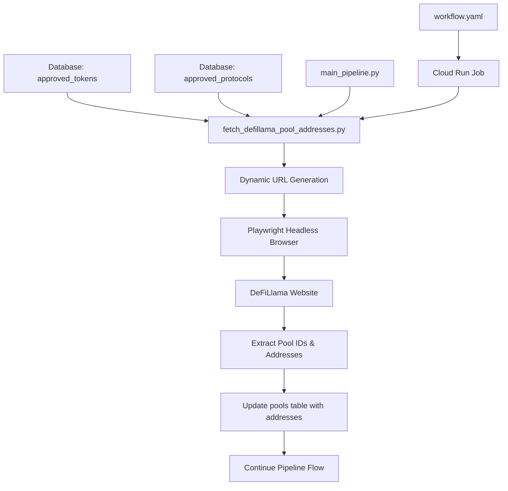
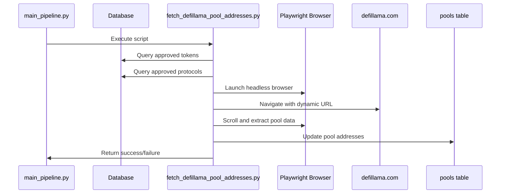

# DeFiLlama Pool Address Crawler Integration Plan

## Overview
This plan outlines the integration of a Playwright-based web crawler to fetch Ethereum pool addresses from DeFiLlama, which are not available through their API. The crawler will dynamically generate URLs based on approved tokens and protocols from the database, then update the pool addresses in the pools table.

## Architecture Diagram



## Detailed Implementation Plan

### 1. Core Script Development (`fetch_defillama_pool_addresses.py`)

**Key Components:**
- **Database Integration**: Fetch approved tokens and protocols from the database
- **Dynamic URL Builder**: Construct DeFiLlama URL with query parameters
- **Playwright Implementation**: Headless browser automation
- **Data Extraction**: Port the JavaScript logic to Python
- **Database Update**: Store extracted addresses in the pools table

**URL Generation Logic:**
```python
base_url = "https://defillama.com/yields/stablecoins"
params = {
    "chain": "Ethereum",
    "token": [approved_tokens_from_db],
    "project": [approved_protocols_from_db]
}
```

### 2. Pipeline Integration

**Placement in Pipeline:**
- Execute after `fetch_defillama_pools.py` (to ensure pools exist)
- Execute before `filter_pools_pre.py` (to have addresses available for filtering)
- This ensures addresses are available for all downstream processing

### 3. Production Deployment

**GCP Cloud Run Configuration:**
- Dockerfile updates to include Playwright browser dependencies
- Environment variables for headless operation
- Resource allocation for browser operations
- Timeout configuration for web scraping

**Workflow Integration:**
- New step in `workflow.yaml`
- Terraform configuration for Cloud Run job
- Proper error handling and retry logic

### 4. Technical Considerations

**Error Handling:**
- Network timeouts and retries
- Empty result handling
- Website structure change detection
- Database connection error handling

**Performance Optimization:**
- Efficient scrolling strategy
- Batch database updates
- Memory management for large datasets
- Parallel processing where possible

**Security:**
- Headless browser configuration
- User-agent rotation (if needed)
- Rate limiting considerations

### 5. Data Flow



## Implementation Steps

1. **Setup Phase**
   - Add `playwright` to requirements.txt
   - Create base script structure with database connections
   - Implement dynamic URL generation

2. **Crawler Development**
   - Port JavaScript logic to Python
   - Implement Playwright browser automation
   - Add scrolling and data extraction logic
   - Implement error handling and retries

3. **Database Integration**
   - Create update functions for pools table
   - Implement batch updates for performance
   - Add logging and monitoring

4. **Pipeline Integration**
   - Add script to main_pipeline.py
   - Update workflow.yaml
   - Configure Terraform for Cloud Run

5. **Testing & Deployment**
   - Local testing with headless browser
   - GCP deployment and testing
   - Monitoring and alerting setup

## Key Implementation Details

### JavaScript to Python Translation

The existing JavaScript script performs the following operations:
1. Scrolls through the DeFiLlama yields page to load all pools
2. Extracts pool IDs from URL patterns
3. Finds Ethereum addresses from external links in each pool row
4. Collects data in a Map structure (poolId -> ethereumAddress)
5. Outputs results as CSV

This will be translated to Python with Playwright:
```python
# Example Python structure
async def crawl_defillama_addresses():
    collected_pools = {}
    
    # Launch browser
    async with async_playwright() as p:
        browser = await p.chromium.launch(headless=True)
        page = await browser.new_page()
        
        # Navigate to dynamically generated URL
        await page.goto(generated_url)
        
        # Scroll and collect data
        no_change_count = 0
        previous_size = 0
        
        while no_change_count < 5:
            # Extract pool data
            pool_links = await page.query_selector_all('a[href*="/yields/pool/"]')
            
            for link in pool_links:
                # Extract pool ID and address
                pool_id = extract_pool_id(await link.get_attribute('href'))
                address = await find_ethereum_address(link)
                
                if address:
                    collected_pools[pool_id] = address
            
            # Scroll down
            await page.evaluate('window.scrollBy(0, window.innerHeight)')
            await page.wait_for_timeout(500)
            
            # Check if we found new pools
            if len(collected_pools) == previous_size:
                no_change_count += 1
            else:
                no_change_count = 0
                previous_size = len(collected_pools)
        
        await browser.close()
    
    return collected_pools
```

### Database Schema Updates

The pools table already has a `pool_address` column (added in migration V19). The script will update this column:
```sql
UPDATE pools 
SET pool_address = :ethereum_address 
WHERE pool_id = :pool_id;
```

### Pipeline Integration Code

In main_pipeline.py, the new step will be added:
```python
# After fetch_defillama_pools.py
run_script("data_ingestion.fetch_defillama_pool_addresses", "fetch_defillama_pool_addresses.py")
```

## Benefits

1. **Complete Data**: Addresses missing from API will now be available
2. **Automation**: No manual browser console execution needed
3. **Scalability**: Works both locally and in production
4. **Maintainability**: Integrated into existing pipeline infrastructure
5. **Flexibility**: Dynamic URL generation adapts to changing token/protocol lists

## Dependencies

### New Requirements
- `playwright` - Browser automation framework
- Browser dependencies (handled by Playwright installation)

### Existing Dependencies Used
- `psycopg2-binary` - Database connections
- `sqlalchemy` - Database operations
- `requests` - For potential API fallbacks

## Monitoring and Logging

The script will include comprehensive logging:
- Start/end timestamps
- Number of pools processed
- Success/failure rates
- Error details with stack traces
- Performance metrics (time per pool, total time)

## Rollback Plan

If issues arise:
1. Skip the step in the pipeline (temporary fix)
2. Use existing data without addresses
3. Revert to manual execution if needed
4. Implement fallback to cached addresses

## Future Enhancements

1. **Caching**: Store crawled addresses to avoid re-crawling unchanged pools
2. **Incremental Updates**: Only crawl new or updated pools
3. **Multi-chain Support**: Extend to other blockchains if needed
4. **API Monitoring**: Check if DeFiLlama adds addresses to their API