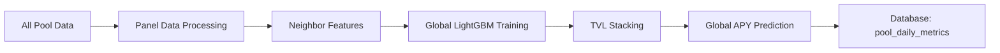

# Global LightGBM Forecasting System

This directory contains the new global LightGBM forecasting system that replaces the previous per-pool XGBoost approach.

## Overview

The global forecasting system uses a single LightGBM model trained on all pools simultaneously, with advanced features including:

- **Neighbor Features**: Group-level statistics, TVL shares, APY rankings
- **Advanced Lags**: 7-day and 30-day lags for multiple variables
- **TVL Stacking**: Predict TVL first, then use as feature for APY prediction
- **Cold-start Handling**: Baseline forecasts for pools with insufficient history
- **Panel Data Processing**: Efficient batch processing of all pools

## Module Structure

### Core Modules

- [`global_forecasting.py`](global_forecasting.py) - Main global forecasting interface
- [`panel_data_utils.py`](panel_data_utils.py) - Panel data fetching and feature building
- [`neighbor_features.py`](neighbor_features.py) - Group-level neighbor feature engineering
- [`model_utils.py`](model_utils.py) - Model training and evaluation utilities

### Key Functions

#### Global Model Training
```python
from forecasting.global_forecasting import train_and_forecast_global

result = train_and_forecast_global(
    pool_ids=None,  # Use all filtered pools
    train_days=60,
    forecast_ahead=1,
    use_tvl_stacking=True
)
```

#### Individual Pool Forecasting (Legacy Compatibility)
```python
from forecasting.global_forecasting import train_and_forecast_pool

result = train_and_forecast_pool(
    pool_id='specific_pool_id',
    steps=1
)
```

## Data Flow



## Feature Engineering

### Base Features
- **Exogenous Variables**: ETH, BTC, gas prices, TVL, APY (shifted to prevent leakage)
- **Time Features**: Day of week/year (cyclical encoding)
- **Lagged Features**: 7-day and 30-day lags for key variables

### Neighbor Features
- **Group Statistics**: Mean, median, standard deviation of APY within groups
- **TVL Share**: Pool's TVL relative to group total
- **APY Rank**: Normalized rank of pool within group
- **Excluded Mean**: Group mean excluding the pool itself
- **Historical Trends**: Rolling averages of group statistics

### TVL Stacking Pipeline
1. Train TVL model with cross-validation
2. Generate out-of-fold predictions
3. Train final TVL model on all data
4. Use TVL predictions as features for APY model

## Configuration

The system supports configuration through constants in [`global_forecasting.py`](global_forecasting.py):

- `HIST_DAYS_PANEL`: History window for panel data (default: 150)
- `MIN_ROWS_PANEL`: Minimum rows for global training (default: 400)
- `GROUP_COL`: Grouping column name (default: "pool_group")
- `EXOG_BASE`: Base exogenous variables
- `LAG_SETS`: Lag configurations for different variables

## Database Integration

The system maintains full compatibility with existing database schema:

- **Table**: `pool_daily_metrics`
- **Forecast Columns**: `forecasted_apy`, `forecasted_tvl`
- **Update Pattern**: Check existence → Update or Insert
- **Transaction Safety**: Proper commit handling

## Error Handling

- **Cold-start Pools**: Baseline forecasts using historical averages
- **Missing Data**: Graceful fallback to global medians
- **Model Failures**: Continue with fallback mechanisms
- **Data Validation**: Robust handling of infinite/missing values

## Performance Benefits

- **Training Efficiency**: Single model vs. hundreds of individual models
- **Cross-Pool Learning**: Leverages patterns across all pools
- **Feature Richness**: Advanced neighbor and lagged features
- **Stacking Benefits**: TVL predictions improve APY accuracy

## Usage

### Running Global Forecasts
```bash
python -m forecasting.forecast_pools
```

### Running with Custom Parameters
```python
from forecasting.global_forecasting import train_and_forecast_global

result = train_and_forecast_global(
    pool_ids=['pool_1', 'pool_2'],  # Specific pools
    train_days=90,  # Extended training window
    forecast_ahead=7,  # Multi-day forecast
    use_tvl_stacking=False  # Disable TVL stacking
)
```

## Testing

Run the test suite:
```bash
python -m tests.test_global_forecasting
```

## Migration from XGBoost

This system completely replaces the previous per-pool XGBoost approach while maintaining:

- Same database interface
- Same function signatures (where applicable)
- Same output format
- Enhanced forecasting accuracy
- Better computational efficiency