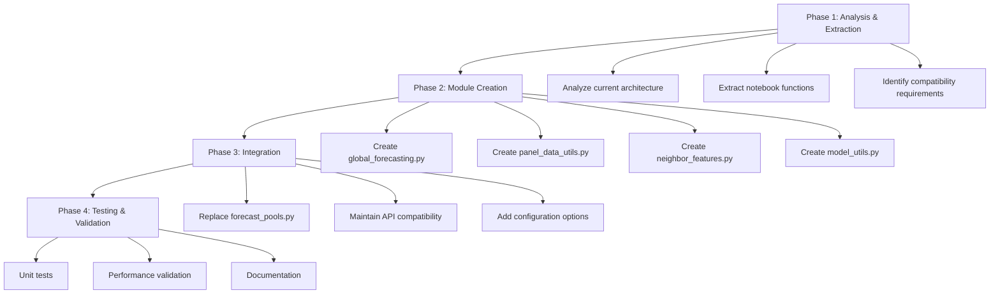
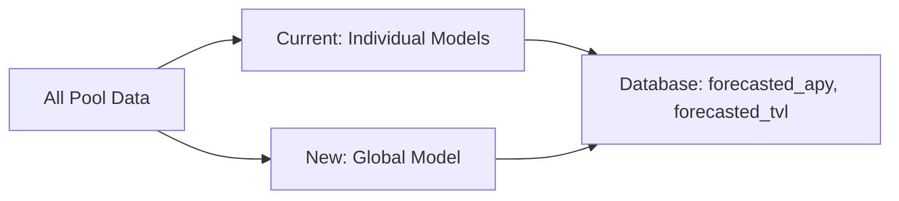

# Forecasting System Migration Plan: Complete Replacement with LightGBM Global Model

## Executive Summary

This plan outlines the complete replacement of the current XGBoost per-pool forecasting approach in `forecasting/forecast_pools.py` with a global LightGBM model approach as implemented in `global_lgbm_v_base.ipynb`. This is a full system replacement, not a hybrid approach, leveraging more sophisticated global modeling techniques including neighbor features and TVL stacking.

## Current vs. Target Architecture

### Current System (XGBoost Per-Pool)
- Individual XGBoost models trained per pool
- Basic exogenous features (ETH, BTC, gas prices)
- Limited lagged features (7-day lags)
- Simple fallback for insufficient data
- Stores forecasts in `pool_daily_metrics.forecasted_apy` and `forecasted_tvl`

### Target System (LightGBM Global Model)
- Single global LightGBM model trained on all pools
- Rich feature set including neighbor features and group statistics
- Advanced lagged features (7-day and 30-day lags)
- TVL stacking approach (predict TVL first, use as APY feature)
- Cold-start handling for new pools
- Same database storage interface

## Detailed Implementation Plan

### Phase 1: Analysis & Extraction ✅

**1.1 Architecture Analysis ✅**
- Documented current `train_and_forecast_pool()` function flow
- Identified data preprocessing requirements from `preprocess_data()`
- Mapped database interactions with `pool_daily_metrics` table

**1.2 Notebook Function Extraction ✅**
- Extracted core functions from `global_lgbm_v_base.ipynb`:
  - `build_global_panel_dataset()` - Panel dataset building
  - `add_neighbor_features()` - Neighbor feature engineering
  - `predict_global_lgbm_head()` - Global prediction interface
  - `fit_global_panel_model()` - Global model training
  - `make_tvl_oof()` - TVL stacking approach
- Adapted Jupyter notebook code to production-ready Python modules

### Phase 2: Module Creation

**2.1 Global Forecasting Module (`forecasting/global_forecasting.py`)**
- Implement global LightGBM model training
- Add TVL stacking approach from notebook
- Include cold-start handling for pools with insufficient history
- Maintain same return format as current system

**2.2 Panel Data Utilities (`forecasting/panel_data_utils.py`)**
- Implement `fetch_panel_history()` functionality
- Add `build_pool_feature_row()` for feature engineering
- Implement data validation and cleaning routines

**2.3 Neighbor Features (`forecasting/neighbor_features.py`)**
- Port `add_neighbor_features()` logic
- Implement group-level statistics calculations
- Add TVL share and APY ranking features

**2.4 Model Utilities (`forecasting/model_utils.py`)**
- Create model training and evaluation utilities
- Implement cross-validation strategies
- Add model persistence and loading functionality

### Phase 3: Integration

**3.1 Complete Replacement of Main Forecasting Module**
- Replace `train_and_forecast_pool()` with global model approach
- Replace `main()` function with global forecasting workflow
- Maintain existing function signature and return format
- Remove all per-pool model training code

**3.2 Database Compatibility**
- Ensure new system writes to same `forecasted_apy` and `forecasted_tvl` columns
- Maintain existing `persist_forecasts()` function interface
- Preserve all existing database interactions

### Phase 4: Testing & Validation

**4.1 Unit Testing**
- Create tests for all new modules
- Test edge cases and error conditions
- Validate feature engineering pipeline

**4.2 Performance Validation**
- Compare forecast accuracy against current system
- Measure training and prediction performance
- Validate memory and resource usage

**4.3 Documentation**
- Update function docstrings
- Create integration guide
- Document configuration options

## Key Technical Implementation Details

### Data Flow Transformation

### Feature Engineering Enhancements
- **Neighbor Features**: Group-level statistics, TVL shares, APY rankings
- **Advanced Lags**: 7-day and 30-day lags for multiple variables
- **Calendar Features**: Cyclical encoding for day-of-week, day-of-year
- **Stacking Approach**: TVL predictions → APY model features → Final APY predictions

### Core Components to Replace

**1. Complete Removal of:**
- `ForecasterRecursive` with XGBoost per-pool models
- `bayesian_search_forecaster` hyperparameter optimization
- Individual model training and persistence logic

**2. Complete Implementation of:**
- Global LightGBM model with advanced features
- Panel-based training approach
- TVL stacking for improved APY predictions
- Cold-start handling for new pools
- Group-level neighbor features

### Database Integration
- Maintain existing `pool_daily_metrics` table structure
- Write predictions to same `forecasted_apy` and `forecasted_tvl` columns
- Use existing `persist_forecasts()` pattern adapted for global model

### Error Handling & Fallbacks
- Implement cold-start baseline from notebook for pools with < 2 valid APY values
- Add robust missing data handling for panel features
- Include graceful degradation for missing neighbor data
- Maintain existing database transaction patterns

## Implementation Timeline

| Week | Focus | Key Deliverables |
|-------|---------|-----------------|
| 1 | Module Extraction | Production-ready modules from notebook ✅ |
| 2-3 | Core Implementation | Global model, neighbor features, TVL stacking |
| 4 | System Replacement | Complete forecast_pools.py replacement |
| 5 | Testing & Validation | Comprehensive test suite, performance validation |

## Success Criteria

- [ ] Global LightGBM model fully replaces per-pool XGBoost approach
- [ ] All neighbor features and TVL stacking implemented
- [ ] Same database interface maintained (forecasted_apy, forecasted_tvl)
- [ ] Cold-start handling working for new pools
- [ ] Performance meets or exceeds current system accuracy
- [ ] Complete test coverage achieved
- [ ] Integration with main pipeline successful

## Risk Mitigation

1. **Complete Replacement Strategy**: No hybrid approach - full migration to global model
2. **Performance Focus**: Optimize for accuracy and training speed
3. **Data Validation**: Robust handling of missing panel data
4. **Testing Coverage**: Comprehensive unit and integration tests

## Next Steps

This plan provides a structured approach to migrating to a more sophisticated global LightGBM forecasting system while maintaining system stability and database compatibility. The implementation will proceed in phases, starting with module creation and ending with complete system replacement.

**Ready for implementation in Code mode.**