# Local Orchestration Pipeline Diagram

```mermaid
graph TD
    A[Start Local Pipeline] --> B[Apply Database Migrations];
    B --> C[Create Initial Allocation Snapshots];
    C --> D{Phase 1: Initial Data Ingestion};
    D --> D1[fetch_ohlcv_coinmarketcap.py];
    D1 --> D2[fetch_gas_ethgastracker.py];
    D2 --> D3[fetch_defillama_pools.py];
    D3 --> D4[fetch_account_transactions.py];
    D4 --> E{Phase 2: Pre-Filtering & Pool History Ingestion};
    E --> E1[filter_pools_pre.py];
    E1 --> E2[fetch_filtered_pool_histories.py];
    E2 --> F{Phase 3: Pool Analysis & Final Filtering};
    F --> F1[calculate_pool_metrics.py];
    F1 --> F2[apply_pool_grouping.py];
    F2 --> F3[process_icebox_logic.py];
    F3 --> F4[update_allocation_snapshots.py];
    F4 --> F5[filter_pools_final.py];
    F5 --> F6[process_account_transactions.py];
    F6 --> H{Phase 4: Forecasting};
    H --> H1[forecast_pools.py];
    H1 --> H2[forecast_gas_fees.py];
    H2 --> I{Phase 5: Asset Allocation};
    I --> I1[manage_ledger.py];
    I1 --> I2[optimize_allocations.py];
    I2 --> J{Phase 6: Reporting & Notification};
    J --> J1[post_slack_notification.py];
    J1 --> K[End Local Pipeline];
```



## Phase Descriptions

### Phase 0: Initialization
- **Apply Database Migrations**: Ensures database schema is up to date
- **Create Initial Allocation Snapshots**: Creates baseline allocation parameter snapshots

### Phase 1: Initial Data Ingestion
- **fetch_ohlcv_coinmarketcap.py**: Fetches OHLCV data from CoinMarketCap
- **fetch_gas_ethgastracker.py**: Fetches gas fee data from EthGasTracker
- **fetch_defillama_pools.py**: Fetches pool data from DeFiLlama
- **fetch_account_transactions.py**: Fetches account transaction data from Ethplorer

### Phase 2: Pre-Filtering & Pool History Ingestion
- **filter_pools_pre.py**: Applies initial filtering to pools (without icebox logic)
- **fetch_filtered_pool_histories.py**: Fetches historical data for filtered pools

### Phase 3: Pool Analysis & Final Filtering
- **calculate_pool_metrics.py**: Calculates pool metrics and statistics
- **apply_pool_grouping.py**: Applies grouping logic to pools
- **process_icebox_logic.py**: Processes icebox logic for special tokens
- **update_allocation_snapshots.py**: Updates allocation snapshots after icebox processing
- **filter_pools_final.py**: Applies final filtering (with icebox logic)
- **process_account_transactions.py**: Processes historical account transactions

### Phase 4: Forecasting
- **forecast_pools.py**: Generates pool APY forecasts
- **forecast_gas_fees.py**: Generates gas fee forecasts

### Phase 5: Asset Allocation
- **manage_ledger.py**: Updates daily balances and ledger
- **optimize_allocations.py**: Runs portfolio optimization algorithm

### Phase 6: Reporting & Notification
- **post_slack_notification.py**: Sends notifications to Slack

## Usage

The pipeline can be run in different modes:

```bash
# Run all phases
python main_pipeline.py

# Run specific phases
python main_pipeline.py --phases phase1 phase3

# Run single phase
python main_pipeline.py --phases phase4
```

## Notes

- Each phase is executed sequentially with error handling
- If any phase fails, the pipeline stops with an error
- Comprehensive logging is provided for each phase
- Database migrations are applied before any other operations
- Allocation snapshots are created once at start and updated after icebox processing