# Data Pipeline Flow & Filtering Logic

This document maps the execution flow of `main_pipeline.py`, specifically highlighting why **Forecasting (Phase 4)** must occur before **Final Filtering (Phase 5)**.

## ⏱️ Pipeline Execution Sequence

The diagram below shows the exact timeline of events. Notice how **Phase 4 (Forecasting)** populates the data that **Phase 5 (Final Filtering)** requires to make its decisions.

```mermaid
sequenceDiagram
    autonumber
    participant Main as 🚀 Main Pipeline
    participant DB as 💾 Database
    participant P2 as Phase 2: Pre-Filter
    participant P3 as Phase 3: Metrics & Icebox
    participant P4 as Phase 4: Forecasting
    participant P5 as Phase 5: Final Filter

    Note over Main: Pipeline Starts

    %% Phase 2
    rect rgb(70, 130, 180)
    Note over Main, P2: 1. PRE-FILTERING (The Broad Net)
    Main->>P2: Run filter_pools_pre.py
    P2->>DB: RESET all pools to "Not Filtered"
    P2->>DB: MARK "Filtered" if Protocol/Chain is invalid
    Note right of P2: Result: A list of "Technically Valid" pools
    end

    %% Phase 3
    rect rgb(139, 69, 19)
    Note over Main, P3: 2. ANALYSIS (Data Prep)
    Main->>P3: Run calculate_pool_metrics.py
    P3->>DB: CALCULATE & SAVE historical metrics (Volatility, etc.)
    
    Main->>P3: Run process_icebox_logic.py
    P3->>DB: UPDATE "Icebox Tokens" list
    Note right of P3: ⚠️ Identifies risky tokens but<br/>DOES NOT filter pools yet!
    end

    %% Phase 4
    rect rgb(34, 139, 34)
    Note over Main, P4: 3. FORECASTING (The Crystal Ball)
    Main->>P4: Run forecast_pools.py
    P4->>DB: READ pools where is_filtered_out = FALSE
    P4->>DB: READ historical metrics
    P4->>DB: WRITE "forecasted_apy" & "forecasted_tvl" columns
    Note right of P4: 💡 This data is REQUIRED for the next step
    end

    %% Phase 5
    rect rgb(204, 85, 0)
    Note over Main, P5: 4. FINAL FILTERING (The Gatekeeper)
    Main->>P5: Run filter_pools_final.py
    P5->>DB: READ "forecasted_apy" (created in Step 3)
    P5->>DB: READ "icebox_tokens" (updated in Step 2)
    
    loop For each candidate pool
        P5->>P5: Check: Is Forecast APY < Limit?
        P5->>P5: Check: Is Forecast TVL < Limit?
        P5->>P5: Check: Is Token in Icebox?
    end
    
    P5->>DB: MARK "Filtered" (is_filtered_out = TRUE)<br/>if any check fails
    end

    Note over Main: Phase 6: Asset Allocation (Uses only remaining pools)
```



## 🔑 Key Takeaways for your Mental Map

1.  **Pre-Filtering (Step 1)** is purely technical (e.g., "Is this on Ethereum?"). It casts a wide net so we don't waste time processing junk.
2.  **Icebox Logic (Step 2)** only *identifies* bad actors (tokens). It puts them on a "Watch List" in the database but doesn't kick pools out yet.
3.  **Forecasting (Step 3)** must happen before final filtering because the filtering rules depend on *future* (predicted) performance, not just the past.
4.  **Final Filtering (Step 4)** is the executioner. It looks at the "Watch List" (Icebox) and the "Crystal Ball" (Forecasts) to make the final cut.

## 📊 Detailed Phase Breakdown

### Phase 1: Initial Data Ingestion
- Fetches raw data from various sources (DeFiLlama, CoinMarketCap, Gas Tracker, etc.)
- Populates raw data tables in the database
- **No filtering occurs at this stage**

### Phase 2: Pre-Filtering (`filter_pools_pre.py`)
**Purpose:** Apply basic validity checks to filter out obviously unsuitable pools
**Criteria:**
- ✅ Approved protocols only
- ✅ Ethereum chain only
- ✅ Approved tokens only
- ❌ Does NOT check TVL, APY, or icebox status
**Action:**
- Resets `currently_filtered_out` flag to `FALSE` for all pools
- Sets `is_filtered_out = TRUE` in `pool_daily_metrics` for pools that fail basic checks
- Updates `underlying_tokens` field for approved pools

### Phase 3: Pool Analysis & Metrics Calculation
**Purpose:** Prepare data for forecasting and identify risky tokens
**Actions:**
1. **`calculate_pool_metrics.py`:**
   - Calculates rolling APY (7d, 30d)
   - Calculates APY volatility (standard deviation)
   - Calculates APY deltas
   - Fetches exogenous data (ETH/BTC prices, gas fees)
   - Stores all metrics in `pool_daily_metrics`

2. **`process_icebox_logic.py`:**
   - Analyzes OHLCV data for approved tokens
   - Identifies tokens that breach price drop thresholds
   - Adds tokens to `icebox_tokens` table if they breach limits
   - Removes tokens from icebox if they recover
   - **Important:** Only updates the icebox list, does NOT filter pools yet

### Phase 4: Forecasting (`forecast_pools.py`)
**Purpose:** Predict future performance of pre-filtered pools
**Process:**
1. Selects pools where `is_filtered_out = FALSE` (from Phase 2)
2. Uses historical metrics from Phase 3 to train models
3. Generates next-day forecasts for APY and TVL
4. Stores predictions in `pool_daily_metrics`:
   - `forecasted_apy`
   - `forecasted_tvl`

**Critical Dependency:** This phase MUST run before final filtering because the filtering logic depends on these forecasted values.

### Phase 5: Final Filtering (`filter_pools_final.py`)
**Purpose:** Apply performance-based and risk-based filters
**Criteria:**
- ❌ Forecasted APY below minimum threshold
- ❌ Forecasted TVL below minimum threshold
- ❌ Pool contains tokens currently in icebox
**Action:**
- Reads `forecasted_apy` and `forecasted_tvl` from Phase 4
- Reads current `icebox_tokens` list from Phase 3
- Updates `is_filtered_out = TRUE` for pools that fail any criteria
- Combines new filter reasons with any existing ones

### Phase 6: Asset Allocation
**Purpose:** Allocate capital to pools that passed all filters
**Process:**
- Only considers pools where `is_filtered_out = FALSE`
- Runs optimization algorithms
- Generates allocation recommendations
- Updates ledger with final decisions

## 🔄 Data Flow Summary

```
Raw Data → Pre-Filter → Metrics & Icebox → Forecasting → Final Filter → Allocation
```

## ⚠️ Common Confusion Points

1.  **Why not filter by icebox in Phase 2?**
    - Icebox detection requires OHLCV analysis which happens in Phase 3
    - The icebox list needs to be current, which requires fresh price data

2.  **Why forecast before filtering?**
    - Final filtering rules depend on forecasted values (APY & TVL)
    - Without forecasts, we couldn't filter based on expected performance

3.  **Why two filtering phases?**
    - Phase 2 is quick and cheap (basic checks)
    - Phase 5 is expensive (requires forecasting) but more accurate
    - This saves computation by not forecasting obviously bad pools

4.  **What happens if a pool is in the icebox?**
    - It's only filtered out in Phase 5, not Phase 2
    - This allows for recovery: if a token leaves the icebox, the pool can be used again